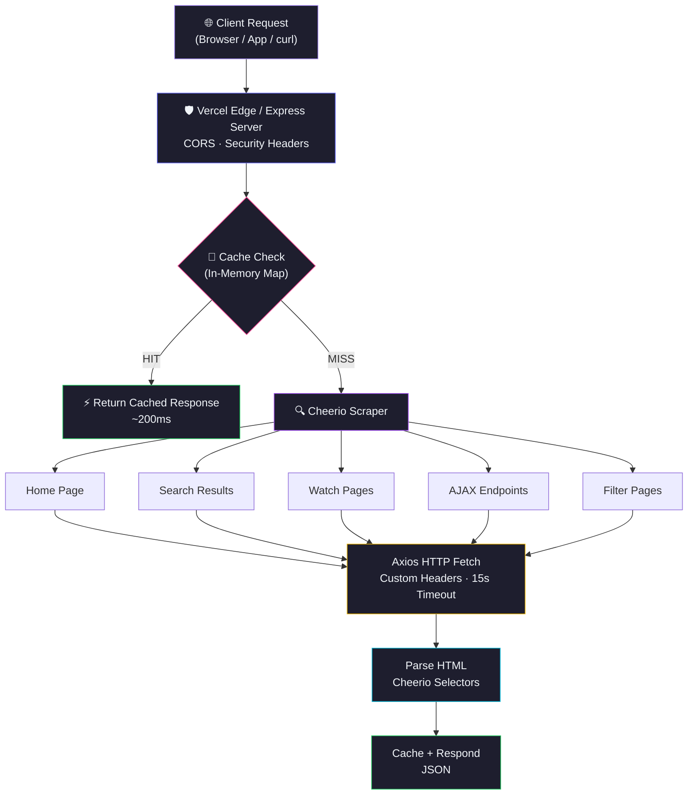
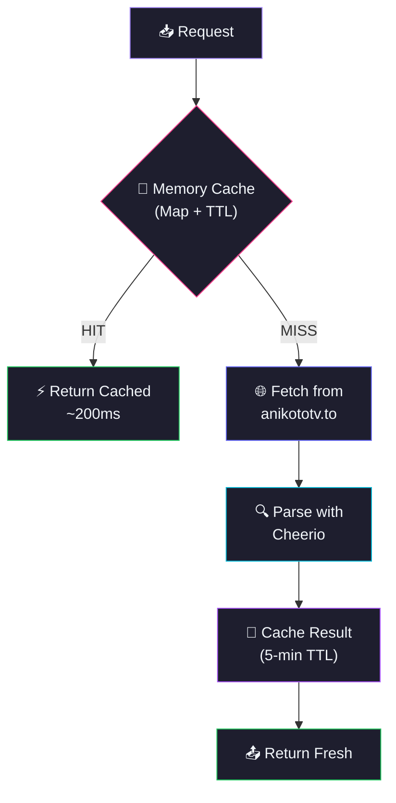

<div align="center">
  
  

</div>

<p align="center">
  <a href="https://github.com/Shineii86/AniKotoAPI/stargazers"></a>
  <a href="https://github.com/Shineii86/AniKotoAPI/network/members"></a>
  <a href="https://github.com/Shineii86/AniKotoAPI/issues"></a>
  <a href="https://github.com/Shineii86/AniKotoAPI/pulls"></a>
  <a href="https://github.com/Shineii86/AniKotoAPI/commits"></a>
  <a href="https://github.com/Shineii86/AniKotoAPI/blob/main/LICENSE"></a>
</p>

<p align="center">
  
  
  
  
  
  
  
  
</p>

<p align="center">
  <b>A complete RESTful API scraping real-time anime data from anikototv.to</b><br/>
  Search, browse, filter, watch — every endpoint returns live data with 5-minute smart caching.<br/>
  Built for building anime websites, apps, and bots.
</p>

<p align="center">
  <a href="#-table-of-contents">Table of Contents</a> &bull;
  <a href="#-features">Features</a> &bull;
  <a href="#-api-endpoints">API Docs</a> &bull;
  <a href="#-quick-start">Quick Start</a> &bull;
  <a href="#-deployment">Deployment</a> &bull;
  <a href="#-contributing">Contributing</a>
</p>

---

> ## ⚠️ Disclaimer
>
> 1. This `API` does not store any files — it only links to media hosted on 3rd party services.
> 2. This `API` is explicitly made for **educational purposes only** and not for commercial usage. This repo will not be responsible for any misuse of it.
> 3. All anime data, images, and content belong to their respective owners. This project is not affiliated with anikototv.to.

---

## 📖 Table of Contents

- [Overview](#-overview)
- [Features](#-features)
- [Anime Data Source](#-anime-data-source)
- [Tech Stack](#-tech-stack)
- [Architecture](#-architecture)
- [Project Structure](#-project-structure)
- [Quick Start](#-quick-start)
- [Configuration](#-configuration)
- [API Endpoints](#-api-endpoints)
- [API Response Schema](#-api-response-schema)
- [Deployment](#-deployment)
- [Available Scripts](#-available-scripts)
- [Performance](#-performance)
- [Changelog Highlights](#-changelog-highlights)
- [Troubleshooting](#-troubleshooting)
- [FAQ](#-faq)
- [Roadmap](#-roadmap)
- [Contributing](#-contributing)
- [Acknowledgements](#-acknowledgements)
- [License](#-license)
- [Author](#-author)
- [Star History](#-star-history)

---

## 🌸 Overview

**AniKotoAPI** is a serverless anime data API that scrapes and serves real-time information from **anikototv.to** — including anime details, episode lists, streaming servers, search, filtering, rankings, and more — all through a clean REST API with zero database setup.

> 💡 No database, no auth, no complex setup. Just deploy to Vercel and you have a production API.

### Why AniKotoAPI?

- 🎬 **27 Endpoints** — Complete coverage of anikototv.to data
- 🔍 **Full-Text Search** — Search anime by keyword with suggestions
- 📺 **Episode Lists** — AJAX-loaded episode data with server info
- 🎯 **Smart Filtering** — Genre, type, status, rating, sort, season, year
- 🏆 **Rankings** — Top 10 (day/week/month), trending, most popular
- 🎲 **Random Anime** — Random anime discovery endpoint
- ⚡ **Smart Caching** — 5-minute TTL reduces source site load
- 🔒 **CORS Enabled** — Works from any frontend, no proxy needed
- 🚀 **Zero-Config Deploy** — One click to Vercel, or run standalone with Express
- 📊 **Live Data** — Every response is fresh from the actual website

### How It Works



---

## ✨ Features

<table>
  <tr>
    <td>

### ⚡ Core
- **Real-time scraping** from anikototv.to
- **Smart caching** with 5-minute TTL
- **27 RESTful endpoints** covering all data
- **AJAX episode loading** for accurate data
- **Mapper API integration** for extra servers
- **Graceful error handling** per endpoint

    </td>
    <td>

### 🔍 Data
- **Keyword search** with pagination (`/api/search`)
- **Search suggestions** for autocomplete (`/api/search/suggest`)
- **Advanced filtering** — genre, type, status, rating, sort, season, year
- **AZ List** alphabetical browsing (`/api/az-list/:letter`)
- **Random anime** discovery (`/api/random`)
- **Top 10 rankings** day/week/month (`/api/top-ten`)

    </td>
  </tr>
  <tr>
    <td>

### 📺 Streaming
- **Watch page** — full episode data with servers
- **Stream info** — video embed URLs via AJAX
- **Server list** — all available streaming servers
- **Mapper API** — gogoanime/anivibe server sources
- **Episode navigation** — prev/next episode data
- **Next episode schedule** — countdown timer data

    </td>
    <td>

### 🛡️ Reliability
- **CORS enabled** — works from any frontend
- **Error responses** with descriptive messages
- **Input validation** — required params checked
- **Timeout protection** — 15s per request
- **Multiple domains** — fallback mirror support
- **Zero dependencies on databases** — pure scraping

    </td>
  </tr>
</table>

### 🌟 Feature Highlights

| Feature | Description | Status |
|:---|:---|:---:|
| 🎬 27 API Endpoints | Complete coverage of anime data | ✅ |
| 🔍 Full-Text Search | Keyword search with pagination | ✅ |
| 📺 Episode Lists | AJAX-loaded episode data | ✅ |
| 🎯 Advanced Filtering | Genre, type, status, rating, sort | ✅ |
| 🏆 Top 10 Rankings | Day/week/month leaderboards | ✅ |
| 🎲 Random Anime | Random anime discovery | ✅ |
| 📡 Streaming Servers | Video embed URLs + mapper API | ✅ |
| 📋 AZ List | A-Z alphabetical browsing | ✅ |
| 🔄 Smart Caching | 5-min TTL, in-memory Map | ✅ |
| 🚀 One-Click Deploy | Vercel button deployment | ✅ |
| 🏗️ Express Mode | Standalone server with `npm start` | ✅ |
| 📖 AlisaReactionBot Style | Full JSDoc documentation | ✅ |

---

## 🗞️ Anime Data Source

| Source | Domain | Status | Data |
|:---|:---|:---|:---|
| **AniKoto** | `anikototv.to` | ✅ Active | Primary source |
| **AniKoto** | `anikoto.cz` | ✅ Active | Mirror domain |
| **AniKoto** | `anikoto.me` | ✅ Active | Mirror domain |
| **AniKoto** | `anikoto.net` | ✅ Active | Mirror domain |
| **AniKoto** | `anikoto.se` | ✅ Active | Mirror domain |

### Data Available

| Category | Count | Source |
|:---|:---|:---|
| 🎬 Total Anime | 10,000+ | anikototv.to |
| 📺 Total Episodes | 100,000+ | AJAX endpoints |
| 🏷️ Genres | 43 | Genre pages |
| 🎭 Types | 6 | TV, Movie, OVA, ONA, Special, Music |
| 📊 Statuses | 3 | Airing, Finished, Not Yet Aired |

---

## 🛠️ Tech Stack

| Technology | Purpose | Version | Documentation |
|:---|:---|:---|:---|
| 🟢 [Node.js](https://nodejs.org/) | JavaScript runtime | >= 20 | [Docs](https://nodejs.org/docs/) |
| ⚡ [Express](https://expressjs.com/) | HTTP server framework | 5.2 | [Docs](https://expressjs.com/en/5x/api.html) |
| ▲ [Vercel Functions](https://vercel.com/docs/functions) | Serverless deployment | — | [Docs](https://vercel.com/docs/functions) |
| 🔍 [Cheerio](https://cheerio.js.org/) | HTML parsing & scraping | 1.0 | [Docs](https://cheerio.js.org/docs/) |
| 🌐 [Axios](https://axios-http.com/) | HTTP client | 1.11 | [Docs](https://axios-http.com/docs/intro) |
| 🔧 [dotenv](https://github.com/motdotla/dotenv) | Environment variables | 17.2 | [Docs](https://github.com/motdotla/dotenv) |
| 🔒 [cors](https://github.com/expressjs/cors) | CORS middleware | 2.8 | [Docs](https://github.com/expressjs/cors) |
| 🍪 [cookie-parser](https://github.com/expressjs/cookie-parser) | Cookie parsing | 1.4 | [Docs](https://github.com/expressjs/cookie-parser) |

### 📦 Key Dependencies

```json
{
  "express": "^5.2.0",        // HTTP server
  "axios": "^1.11.0",         // HTTP client for scraping
  "cheerio": "^1.0.0-rc.12",  // HTML parsing
  "cors": "^2.8.5",           // CORS middleware
  "dotenv": "^17.2.0",        // Environment variables
  "cookie-parser": "^1.4.7"   // Cookie parsing
}
```

---

## 🏗️ Architecture

### Request Flow

| Stage | Component | Description |
|:-----:|-----------|-------------|
| 1 | **Client** | Browser, app, or `curl` sends request |
| 2 | **Vercel Edge / Express** | Routes request, applies CORS + security headers |
| 3 | **Cache Check** | In-memory Map with 5-min TTL — hit = instant response |
| 4 | **Scrape Source** | Axios fetches HTML from anikototv.to with custom headers |
| 5 | **Parse HTML** | Cheerio extracts data using CSS selectors |
| 6 | **Cache + Respond** | Store in cache, return JSON response |

### Caching Architecture



> 💡 Serverless functions have read-only filesystems except `/tmp`. The cache uses in-memory `Map` which survives across warm invocations.

---

## 📁 Project Structure

```
AniKotoAPI/
├── 📂 public/                            # 🌐 Static files
│   ├── 📄 index.html                     #    📖 API documentation page
│   └── 📄 404.html                       #    ❌ Custom 404 error page
│
├── 📂 src/                               # ⚙️ Core logic
│   ├── 📂 configs/                       #    🔧 Configuration files
│   │   ├── 📄 dataUrl.js                 #       🌐 URL patterns for anikototv.to
│   │   ├── 📄 header.config.js           #       📋 Request headers
│   │   └── 📄 ids.config.js              #       🏷️ Genre/Type/Status/Rating ID mappings
│   │
│   ├── 📂 controllers/                   #    🎮 Route handlers (22 files)
│   │   ├── 📄 homeInfo.controller.js
│   │   ├── 📄 animeInfo.controller.js
│   │   ├── 📄 search.controller.js
│   │   ├── 📄 episodeList.controller.js
│   │   ├── 📄 episodeListAjax.controller.js
│   │   ├── 📄 streamInfo.controller.js
│   │   ├── 📄 filter.controller.js
│   │   ├── 📄 watchPage.controller.js
│   │   └── 📄 ... (14 more)
│   │
│   ├── 📂 extractors/                    #    🔍 HTML scrapers (22 files)
│   │   ├── 📄 homeInfo.extractor.js      #       🏠 Home page data
│   │   ├── 📄 search.extractor.js        #       🔍 Search results
│   │   ├── 📄 animeInfo.extractor.js     #       📺 Anime details
│   │   ├── 📄 streamInfo.extractor.js    #       📡 Streaming servers
│   │   ├── 📄 filter.extractor.js        #       🎯 Filtered results
│   │   ├── 📄 watchPage.extractor.js     #       ▶️ Watch page data
│   │   ├── 📄 episodeList.extractor.js   #       📋 Episode lists
│   │   └── 📄 ... (15 more)
│   │
│   ├── 📂 helper/                        #    🛠️ Utility functions
│   │   ├── 📄 cache.helper.js            #       💾 In-memory caching
│   │   ├── 📄 countPages.helper.js       #       📄 Pagination counter
│   │   ├── 📄 extractPages.helper.js     #       📃 Page fetcher
│   │   └── 📄 formatTitle.helper.js      #       🔤 Title formatter
│   │
│   └── 📂 routes/                        #    🛤️ Express routes
│       ├── 📄 apiRoutes.js               #       🌐 Main API routes (24 endpoints)
│       └── 📄 category.route.js          #       🏷️ Category routes
│
├── 📄 server.js                          # 🚀 Express server entry point
├── 📄 package.json                       # 📦 Dependencies & scripts
├── 📄 vercel.json                        # ▲ Vercel routing & headers config
├── 📄 CHANGELOG.md                       # 📝 Version history
├── 📄 LICENSE                            # 📜 MIT License
└── 📄 README.md                          # 📖 This file
```

---

## 🚀 Quick Start

### Prerequisites

| Requirement | Minimum | Recommended |
|:---|:---|:---|
| 📦 Node.js | 20.x | 20.x LTS |
| 📦 npm | 9.0+ | 10.x |
| 💻 OS | Windows, macOS, Linux | Any |

### 🔧 Installation

```bash
# 1️⃣ Clone the repository
git clone https://github.com/Shineii86/AniKotoAPI.git
cd AniKotoAPI

# 2️⃣ Install dependencies
npm install

# 3️⃣ Start development server
npm run dev
```

> 🌐 Open [http://localhost:4444](http://localhost:4444) in your browser.

### 🏗️ Build for Production

```bash
# Start production server
npm start
```

### 🐳 Alternative Package Managers

```bash
# Using yarn
yarn install
yarn dev

# Using pnpm
pnpm install
pnpm dev

# Using bun
bun install
bun dev
```

---

## ⚙️ Configuration

### Environment Variables

| Variable | Default | Description |
|:---|:---|:---|
| `PORT` | `4444` | Server port (Express mode only) |
| `ALLOWED_ORIGINS` | `*` | Comma-separated allowed origins |

### Vercel Configuration

The `vercel.json` file handles:
- **Builds** — Maps `server.js` to `@vercel/node`
- **Routes** — All requests forwarded to Express
- **Headers** — CORS `Access-Control-Allow-Origin: *`

---

## 📡 API Endpoints

### Base URL
```
https://anikototvapi.vercel.app/api
```

### Streaming Flow

To get a stream URL, follow these 3 steps:

```bash
# Step 1: Get episodes (returns server_ids)
curl "https://anikototvapi.vercel.app/api/episodes/road-of-naruto-ggjw8"

# Step 2: Get servers (pass server_ids from Step 1)
curl "https://anikototvapi.vercel.app/api/servers?ids=SlNVT25JaFlCMnZOe..."

# Step 3: Get stream URL (pass link_id from Step 2)
curl "https://anikototvapi.vercel.app/api/stream?id=MTF1dkFtaW9BRTZPbz..."
```

---

> ## 🏠 GET Home Info

### Endpoint

```bash
/
```

#### Parameters

> No parameters required.

#### Example of request

```bash
curl "https://anikototvapi.vercel.app/api/"
```

```javascript
import axios from "axios";
const resp = await axios.get("https://anikototvapi.vercel.app/api/");
console.log(resp.data);
```

#### Sample Response

```json
{
  "success": true,
  "results": {
    "spotlights": [
      { "slug": "i-want-you-to-show-me-your-panties-with-a-disgusted-face-returns", "poster": "https://cdn.anipixcdn.co/background/0a53175c11a0c2c1_1780649103.webp", "title": "I Want You To Show Me Your Panties With a Disgusted Face Returns", "japaneseTitle": "Iya na Kao sare nagara Opantsu Misete Moraitai Returns", "description": "", "rating": "", "quality": "HD", "sub": 0, "dub": 0, "date": "Apr 30, 2026 to Jun 4, 2026" },
      { "slug": "wistoria-wand-and-sword-season-2-dua04", "poster": "https://cdn.anipixcdn.co/background/101f58336250ee0d_1779363645.webp", "title": "Wistoria: Wand and Sword Season 2", "japaneseTitle": "Tsue to Tsurugi no Wistoria Season 2", "rating": "PG-13", "quality": "HD", "date": "Apr 12, 2026 to ?" },
      { "slug": "one-piece-odmau", "poster": "https://image.tmdb.org/t/p/original/a6ptrTUH1c5OdWanjyYtAkOuYD0.jpg", "title": "One Piece", "japaneseTitle": "One Piece", "rating": "PG-13", "quality": "HD", "date": "Oct 20, 1999 to ?" }
    ],
    "trending": [
      { "slug": "digimon-beatbreak-u2o7s/ep-34", "poster": "https://cdn.anipixcdn.co/thumbnail/12d6b5e5a791029b893bf3f08733aec2.jpg", "title": "Digimon Beatbreak", "japaneseTitle": "Digimon Beatbreak", "sub": 34, "dub": 25, "total": 0, "type": "TV" },
      { "slug": "ghost-concert-missing-songs-ndxfn/ep-10", "poster": "https://cdn.anipixcdn.co/thumbnail/21c1f9ec2efafedf9e2bd429875471c0.jpg", "title": "Ghost Concert: Missing Songs", "sub": 10, "dub": 0, "total": 12, "type": "TV" },
      { "slug": "one-piece-odmau/ep-1165", "poster": "https://cdn.anipixcdn.co/thumbnail/f899139df5e1059396431415e770c6dd.jpg", "title": "One Piece", "sub": 1165, "dub": 1133, "total": 0, "type": "TV" }
    ],
    "topAiring": [
      { "slug": "i-want-you-to-show-me-your-panties-with-a-disgusted-face-returns", "poster": "https://cdn.anipixcdn.co/thumbnail/1dea34fcedb64cd270f5d2de28f485f1.jpg", "title": "I Want You To Show Me Your Panties With a Disgusted Face Returns", "sub": 6, "dub": 0, "type": "" },
      { "slug": "wistoria-wand-and-sword-season-2-dua04", "poster": "https://cdn.anipixcdn.co/thumbnail/4739d8dbd05dddb73604f6240b83ea68.jpg", "title": "Wistoria: Wand and Sword Season 2", "sub": 9, "dub": 7, "type": "" },
      { "slug": "one-piece-odmau", "poster": "https://cdn.anipixcdn.co/thumbnail/f899139df5e1059396431415e770c6dd.jpg", "title": "One Piece", "sub": 1165, "dub": 1133, "type": "" }
    ],
    "genres": ["Action","Adventure","Cars","Comedy","Dementia","Demons","Drama","Ecchi","Fantasy","Game","Harem","Historical","Horror","Isekai","Josei","Kids","Magic","Mahou Shoujo","Martial Arts","Mecha","Military","Music","Mystery","Parody","Police","Psychological","Romance","Samurai","School","Sci-Fi","Seinen","Shoujo","Shoujo Ai","Shounen","Shounen Ai","Slice of Life","Space","Sports","Super Power","Supernatural","Thriller","unknown","Vampire"]
  }
}
```

---

> ## 🔝 GET Top 10 Anime's Info

### Endpoint

```bash
/top-ten
```

#### Parameters

> No parameters required.

#### Example of request

```bash
curl "https://anikototvapi.vercel.app/api/top-ten"
```

```javascript
import axios from "axios";
const resp = await axios.get("https://anikototvapi.vercel.app/api/top-ten");
console.log(resp.data);
```

#### Sample Response

```json
{
  "success": true,
  "results": {
    "today": [
      { "slug": "i-want-you-to-show-me-your-panties-with-a-disgusted-face-returns", "rank": 1, "name": "I Want You To Show Me Your Panties With a Disgusted Face Returns", "poster": "https://cdn.anipixcdn.co/thumbnail/1dea34fcedb64cd270f5d2de28f485f1.jpg", "sub": 6, "dub": 0, "type": "" },
      { "slug": "wistoria-wand-and-sword-season-2-dua04", "rank": 2, "name": "Wistoria: Wand and Sword Season 2", "poster": "https://cdn.anipixcdn.co/thumbnail/4739d8dbd05dddb73604f6240b83ea68.jpg", "sub": 9, "dub": 7, "type": "" },
      { "slug": "one-piece-odmau", "rank": 3, "name": "One Piece", "poster": "https://cdn.anipixcdn.co/thumbnail/f899139df5e1059396431415e770c6dd.jpg", "sub": 1165, "dub": 1133, "type": "" }
    ],
    "week": [
      { "slug": "one-piece-odmau", "rank": 1, "name": "One Piece", "poster": "https://cdn.anipixcdn.co/thumbnail/f899139df5e1059396431415e770c6dd.jpg", "sub": 1165, "dub": 1133, "type": "" },
      { "slug": "i-want-you-to-show-me-your-panties-with-a-disgusted-face-returns", "rank": 2, "name": "I Want You To Show Me Your Panties With a Disgusted Face Returns", "sub": 6, "dub": 0, "type": "" },
      { "slug": "re-zero-starting-life-in-another-world-season-4-4hk9h", "rank": 3, "name": "Re:ZERO -Starting Life in Another World- Season 4", "sub": 9, "dub": 9, "type": "" }
    ],
    "month": [
      { "slug": "one-piece-odmau", "rank": 1, "name": "One Piece", "poster": "https://cdn.anipixcdn.co/thumbnail/f899139df5e1059396431415e770c6dd.jpg", "sub": 1165, "dub": 1133, "type": "" },
      { "slug": "that-time-i-got-reincarnated-as-a-slime-season-4-0u851", "rank": 2, "name": "That Time I Got Reincarnated as a Slime Season 4", "sub": 9, "dub": 7, "type": "" },
      { "slug": "wistoria-wand-and-sword-season-2-dua04", "rank": 3, "name": "Wistoria: Wand and Sword Season 2", "sub": 9, "dub": 7, "type": "" }
    ]
  }
}
```

---

> ## 🔍 GET Top Search

### Endpoint

```bash
/search
```

#### Parameters

| Parameter | Type | Mandatory | Default | Description |
| :-------: | :--: | :-------: | :-----: | :---------: |
| `keyword` | `string` | Yes ✔️ | — | Search query |
| `page` | `number` | No | `1` | Page number |

#### Example of request

```bash
curl "https://anikototvapi.vercel.app/api/search?keyword=one+piece"
```

```javascript
import axios from "axios";
const resp = await axios.get("https://anikototvapi.vercel.app/api/search", {
  params: { keyword: "one piece", page: 1 }
});
console.log(resp.data);
```

#### Sample Response

```json
{
  "success": true,
  "results": {
    "totalPages": 11,
    "data": [
      { "slug": "one-piece-episode-of-luffy-hand-island-adventure-br7lf/ep-1", "animeId": "769", "poster": "https://cdn.anipixcdn.co/thumbnail/4f16c818875d9fcb6867c7bdc89be7eb.jpg", "title": "One Piece: Episode of Luffy - Hand Island Adventure", "japaneseTitle": "One Piece: Episode of Luffy - Hand Island no Bouken", "sub": 1, "dub": 0, "total": 0, "type": "Special", "rating": "7.68", "genres": ["Action","Adventure","Fantasy","Comedy","Shounen","Super Power"] },
      { "slug": "one-piece-dead-end-n6fbv/ep-1", "animeId": "262", "poster": "https://cdn.anipixcdn.co/thumbnail/242c100dc94f871b6d7215b868a875f8.jpg", "title": "One Piece: Dead End", "japaneseTitle": "One Piece Movie 4: Dead End no Bouken", "sub": 1, "dub": 0, "total": 0, "type": "Movie", "rating": "7.6", "genres": ["Action","Adventure","Fantasy","Comedy","Shounen","Super Power"] },
      { "slug": "one-piece-odmau/ep-1", "animeId": "1642", "poster": "https://cdn.anipixcdn.co/thumbnail/f899139df5e1059396431415e770c6dd.jpg", "title": "One Piece", "japaneseTitle": "One Piece", "sub": 1165, "dub": 1133, "total": 0, "type": "TV", "rating": "8.73", "genres": ["Action","Adventure","Fantasy","Comedy","Shounen","Super Power","Drama"] }
    ]
  }
}
```

---

> ## ℹ️ GET Specified Anime's Info

### Endpoint

```bash
/info
```

#### Parameters

| Parameter | Type | Mandatory | Default | Description |
| :-------: | :--: | :-------: | :-----: | :---------: |
| `id` | `string` | Yes ✔️ | — | Anime slug |

#### Example of request

```bash
curl "https://anikototvapi.vercel.app/api/info?id=one-piece-odmau"
```

```javascript
import axios from "axios";
const resp = await axios.get("https://anikototvapi.vercel.app/api/info", {
  params: { id: "one-piece-odmau" }
});
console.log(resp.data);
```

#### Sample Response

```json
{
  "success": true,
  "results": {
    "slug": "one-piece-odmau",
    "animeId": 1642,
    "title": "One Piece",
    "japaneseTitle": "One Piece",
    "altNames": "One Piece;OP ONE PIECE One Piece; One Piece, One Piece, OP, ONE PIECE",
    "poster": "https://cdn.anipixcdn.co/thumbnail/f899139df5e1059396431415e770c6dd.jpg",
    "backgroundImage": "https://image.tmdb.org/t/p/original/a6ptrTUH1c5OdWanjyYtAkOuYD0.jpg",
    "synopsis": "Gold Roger was known as the \"Pirate King,\" the strongest and most infamous being to have sailed the Grand Line. The capture and execution of Roger by the World Government brought a change throughout the world...",
    "type": "TV",
    "premiered": "&NBSP 1999",
    "aired": "Oct 20, 1999 to ?",
    "status": "Currently Airing",
    "malScore": "8.73",
    "duration": "24 min",
    "episodes": "?",
    "studios": ["Toei Animation"],
    "producers": ["Shueisha", "Funimation", "Fuji TV", "Toei Animation", "4Kids Entertainment", "TAP"],
    "genres": ["Action", "Adventure", "Fantasy", "Comedy", "Shounen", "Super Power", "Drama"],
    "rating": "8.73   8.73 /10",
    "reviewCount": "2667420"
  }
}
```

---

> ## 🎲 GET Random Anime's Info

### Endpoint

```bash
/random
```

#### Parameters

> No parameters required.

#### Example of request

```bash
curl "https://anikototvapi.vercel.app/api/random"
```

```javascript
import axios from "axios";
const resp = await axios.get("https://anikototvapi.vercel.app/api/random");
console.log(resp.data);
```

#### Sample Response

```json
{
  "success": true,
  "results": {
    "slug": "https://anikototv.to/random",
    "animeId": 2298,
    "title": "Keep it a Secret from Maria-sama",
    "japaneseTitle": "Maria-sama ga Miteru 4th Specials",
    "poster": "https://cdn.anipixcdn.co/thumbnail/f35a2bc72dfdc2aae569a0c7370bd7f5.jpg",
    "type": "Special",
    "synopsis": "A series of specials included on the Maria-sama ga Miteru 4th DVD releases.",
    "rating": "7.23   7.23 /10",
    "genres": ["Comedy"],
    "url": "https://anikototv.to/random"
  }
}
```

---

> ## 📅 GET Anime Schedule

### Endpoint

```bash
/schedule
```

#### Parameters

| Parameter | Type | Mandatory | Default | Description |
| :-------: | :--: | :-------: | :-----: | :---------: |
| `date` | `string` | Yes ✔️ | — | Date in `YYYY-MM-DD` format |

#### Example of request

```bash
curl "https://anikototvapi.vercel.app/api/schedule?date=2026-06-08"
```

```javascript
import axios from "axios";
const resp = await axios.get("https://anikototvapi.vercel.app/api/schedule", {
  params: { date: "2026-06-08" }
});
console.log(resp.data);
```

#### Sample Response

```json
{
  "success": true,
  "results": [
    {
      "slug": "anime-slug-xyz/ep-1",
      "title": "Anime Title",
      "episode": "Ep 1",
      "japaneseTitle": "Japanese Title",
      "type": "TV",
      "subs": 1,
      "dubs": 0
    }
  ]
}
```

---

> ## 📺 GET Anime Episodes

### Endpoint

```bash
/episodes/:id
```

#### Parameters

| Parameter | Type | Mandatory | Default | Description |
| :-------: | :--: | :-------: | :-----: | :---------: |
| `id` | `string` | Yes ✔️ | — | Anime slug |

#### Example of request

```bash
curl "https://anikototvapi.vercel.app/api/episodes/one-piece-odmau"
```

```javascript
import axios from "axios";
const resp = await axios.get("https://anikototvapi.vercel.app/api/episodes/one-piece-odmau");
console.log(resp.data);
```

#### Sample Response

```json
{
  "success": true,
  "results": {
    "animeId": 1642,
    "slug": "one-piece-odmau",
    "totalEpisodes": 0,
    "episodes": []
  }
}
```

---

> ## 📡 GET Anime Stream Info

### Endpoint

```bash
/watch
```

#### Parameters

| Parameter | Type | Mandatory | Default | Description |
| :-------: | :--: | :-------: | :-----: | :---------: |
| `slug` | `string` | Yes ✔️ | — | Anime slug |
| `ep` | `number` | Yes ✔️ | — | Episode number |

#### Example of request

```bash
curl "https://anikototvapi.vercel.app/api/watch?slug=one-piece-odmau&ep=1165"
```

```javascript
import axios from "axios";
const resp = await axios.get("https://anikototvapi.vercel.app/api/watch", {
  params: { slug: "one-piece-odmau", ep: 1165 }
});
console.log(resp.data);
```

#### Sample Response

```json
{
  "success": true,
  "results": {
    "slug": "one-piece-odmau",
    "animeId": 1642,
    "animeUrl": "https://anikototv.to/watch/one-piece-odmau",
    "title": "One Piece",
    "japaneseTitle": "One Piece",
    "episodeNumber": 1165,
    "synopsis": "Gold Roger was known as the \"Pirate King,\" the strongest and most infamous being to have sailed the Grand Line...",
    "type": "TV",
    "status": "Currently Airing",
    "malScore": "8.73",
    "duration": "24 min",
    "episodes": "?",
    "studios": ["Toei Animation"],
    "genres": ["Action", "Adventure", "Fantasy", "Comedy", "Shounen", "Super Power", "Drama"],
    "rating": "8.73   8.73 /10",
    "poster": "https://cdn.anipixcdn.co/thumbnail/f899139df5e1059396431415e770c6dd.jpg",
    "backgroundImage": "https://image.tmdb.org/t/p/original/a6ptrTUH1c5OdWanjyYtAkOuYD0.jpg",
    "nextEpisodeDate": "× The next episode is predicted to arrive on 2026/06/14 02:16 PM GMT ()",
    "nextEpisodeTimestamp": 1781446560,
    "servers": [],
    "trending": [
      { "slug": "solo-leveling-season-2-arise-from-the-shadow-3eukp", "poster": "https://cdn.anipixcdn.co/thumbnail/4b5ed938de41e4ff532c02c27dfd143a.jpg", "title": "Solo Leveling Season 2: Arise from the Shadow", "type": "13 Eps", "score": "8.87" },
      { "slug": "one-piece-odmau", "poster": "https://cdn.anipixcdn.co/thumbnail/f899139df5e1059396431415e770c6dd.jpg", "title": "One Piece", "type": "? Eps", "score": "8.73" },
      { "slug": "sakamoto-days-sfdxz", "poster": "https://cdn.anipixcdn.co/thumbnail/908e9281295d180348ec77afe6be6b01.jpg", "title": "Sakamoto Days", "type": "11 Eps", "score": "7.71" }
    ],
    "recommended": [
      { "slug": "one-piece-episode-of-sabo-the-three-brothers-bond-hamg1", "poster": "https://cdn.anipixcdn.co/thumbnail/2f885d0fbe2e131bfc9d98363e55d1d4.jpg", "title": "One Piece: Episode of Sabo - The Three Brothers' Bond", "type": "Unknown" },
      { "slug": "one-piece-episode-of-east-blue-f58nd", "poster": "https://cdn.anipixcdn.co/thumbnail/6766aa2750c19aad2fa1b32f36ed4aee.jpg", "title": "One Piece: Episode of East Blue", "type": "Unknown" },
      { "slug": "fullmetal-alchemist-brotherhood-9s0fl", "poster": "https://cdn.anipixcdn.co/thumbnail/c4ca4238a0b923820dcc509a6f75849b.jpeg", "title": "Fullmetal Alchemist: Brotherhood", "type": "2009" }
    ]
  }
}
```

---

> ## 🖥️ GET Available Servers

### Endpoint

```bash
/servers
```

#### Parameters

| Parameter | Type | Mandatory | Default | Description |
| :-------: | :--: | :-------: | :-----: | :---------: |
| `ids` | `string` | Yes ✔️ | — | Episode IDs |

#### Example of request

```bash
curl "https://anikototvapi.vercel.app/api/servers?ids={episodeIds}"
```

```javascript
import axios from "axios";
const resp = await axios.get("https://anikototvapi.vercel.app/api/servers", {
  params: { ids: "yourEpisodeIds" }
});
console.log(resp.data);
```

#### Sample Response

```json
{
  "success": true,
  "results": {
    "sub": [
      { "server_id": 1, "server_name": "Vidstreaming", "type": "sub" },
      { "server_id": 2, "server_name": "Gogocdn", "type": "sub" }
    ],
    "dub": [
      { "server_id": 3, "server_name": "Vidstreaming", "type": "dub" }
    ]
  }
}
```

---

> ## 🗺️ GET Mapper Servers

### Endpoint

```bash
/mapper-servers
```

#### Parameters

| Parameter | Type | Mandatory | Default | Description |
| :-------: | :--: | :-------: | :-----: | :---------: |
| `malId` | `number` | Yes ✔️ | — | MyAnimeList ID |
| `slug` | `string` | Yes ✔️ | — | Anime slug |
| `timestamp` | `number` | Yes ✔️ | — | Current timestamp |

#### Example of request

```bash
curl "https://anikototvapi.vercel.app/api/mapper-servers?malId=21&slug=one-piece&timestamp=1717900000"
```

```javascript
import axios from "axios";
const resp = await axios.get("https://anikototvapi.vercel.app/api/mapper-servers", {
  params: { malId: 21, slug: "one-piece", timestamp: 1717900000 }
});
console.log(resp.data);
```

#### Sample Response

```json
{
  "success": true,
  "results": [
    {
      "provider": "gogoanime",
      "type": "sub",
      "url": "https://embtaku.pro/embed?id=...",
      "download": "https://gogodl.net/download?id=..."
    },
    {
      "provider": "gogoanime",
      "type": "dub",
      "url": "https://embtaku.pro/embed?id=...",
      "download": "https://gogodl.net/download?id=..."
    }
  ]
}
```

---

### `GET /api/servers`

Server list for an episode — returns available streaming servers with their names and types.

| Param | Type | Default | Description |
|:---|:---|:---|:---|
| `ids` | `string` | **required** | Episode IDs |

```bash
curl "https://anikototvapi.vercel.app/api/servers?ids={episodeIds}"
```

```javascript
import axios from "axios";
const resp = await axios.get("https://anikototvapi.vercel.app/api/servers", {
  params: { ids: "yourEpisodeIds" }
});
console.log(resp.data);
```

<details>
<summary>📄 Example Response</summary>

```json
{
  "success": true,
  "results": {
    "sub": [
      { "server_id": 1, "server_name": "Vidstreaming", "type": "sub" },
      { "server_id": 2, "server_name": "Gogocdn", "type": "sub" }
    ],
    "dub": [
      { "server_id": 3, "server_name": "Vidstreaming", "type": "dub" }
    ]
  }
}
```
</details>

---

### `GET /api/mapper-servers`

Mapper API — fetches additional streaming servers from gogoanime/anivibe via the nekostream mapper service. Returns sub/dub server URLs for each provider.

| Param | Type | Default | Description |
|:---|:---|:---|:---|
| `malId` | `number` | **required** | MyAnimeList ID |
| `slug` | `string` | **required** | Anime slug |
| `timestamp` | `number` | **required** | Current timestamp |

```bash
curl "https://anikototvapi.vercel.app/api/mapper-servers?malId=21&slug=one-piece&timestamp=1717900000"
```

```javascript
import axios from "axios";
const resp = await axios.get("https://anikototvapi.vercel.app/api/mapper-servers", {
  params: { malId: 21, slug: "one-piece", timestamp: 1717900000 }
});
console.log(resp.data);
```

<details>
<summary>📄 Example Response</summary>

```json
{
  "success": true,
  "results": [
    {
      "provider": "gogoanime",
      "type": "sub",
      "url": "https://embtaku.pro/embed?id=...",
      "download": "https://gogodl.net/download?id=..."
    },
    {
      "provider": "gogoanime",
      "type": "dub",
      "url": "https://embtaku.pro/embed?id=...",
      "download": "https://gogodl.net/download?id=..."
    }
  ]
}
```
</details>

---

### `GET /api/top-ten`

Top 10 anime rankings for day, week, and month.

```bash
curl "https://anikototvapi.vercel.app/api/top-ten"
```

```javascript
import axios from "axios";
const resp = await axios.get("https://anikototvapi.vercel.app/api/top-ten");
console.log(resp.data);
```

<details>
<summary>📄 Example Response</summary>

```json
{
  "success": true,
  "results": {
    "today": [
      { "slug": "i-want-you-to-show-me-your-panties-with-a-disgusted-face-returns", "rank": 1, "name": "I Want You To Show Me Your Panties With a Disgusted Face Returns", "poster": "https://cdn.anipixcdn.co/thumbnail/1dea34fcedb64cd270f5d2de28f485f1.jpg", "sub": 6, "dub": 0, "type": "" },
      { "slug": "wistoria-wand-and-sword-season-2-dua04", "rank": 2, "name": "Wistoria: Wand and Sword Season 2", "poster": "https://cdn.anipixcdn.co/thumbnail/4739d8dbd05dddb73604f6240b83ea68.jpg", "sub": 9, "dub": 7, "type": "" },
      { "slug": "one-piece-odmau", "rank": 3, "name": "One Piece", "poster": "https://cdn.anipixcdn.co/thumbnail/f899139df5e1059396431415e770c6dd.jpg", "sub": 1165, "dub": 1133, "type": "" }
    ],
    "week": [
      { "slug": "one-piece-odmau", "rank": 1, "name": "One Piece", "poster": "https://cdn.anipixcdn.co/thumbnail/f899139df5e1059396431415e770c6dd.jpg", "sub": 1165, "dub": 1133, "type": "" },
      { "slug": "i-want-you-to-show-me-your-panties-with-a-disgusted-face-returns", "rank": 2, "name": "I Want You To Show Me Your Panties With a Disgusted Face Returns", "sub": 6, "dub": 0, "type": "" },
      { "slug": "re-zero-starting-life-in-another-world-season-4-4hk9h", "rank": 3, "name": "Re:ZERO -Starting Life in Another World- Season 4", "sub": 9, "dub": 9, "type": "" }
    ],
    "month": [
      { "slug": "one-piece-odmau", "rank": 1, "name": "One Piece", "poster": "https://cdn.anipixcdn.co/thumbnail/f899139df5e1059396431415e770c6dd.jpg", "sub": 1165, "dub": 1133, "type": "" },
      { "slug": "that-time-i-got-reincarnated-as-a-slime-season-4-0u851", "rank": 2, "name": "That Time I Got Reincarnated as a Slime Season 4", "sub": 9, "dub": 7, "type": "" },
      { "slug": "wistoria-wand-and-sword-season-2-dua04", "rank": 3, "name": "Wistoria: Wand and Sword Season 2", "sub": 9, "dub": 7, "type": "" }
    ]
  }
}
```
</details>

---

> ## ⭐ GET Spotlight

### Endpoint

```bash
/spotlight
```

#### Parameters

> No parameters required.

#### Example of request

```bash
curl "https://anikototvapi.vercel.app/api/spotlight"
```

```javascript
import axios from "axios";
const resp = await axios.get("https://anikototvapi.vercel.app/api/spotlight");
console.log(resp.data);
```

#### Sample Response

```json
{
  "success": true,
  "results": [
    {
      "slug": "i-want-you-to-show-me-your-panties-with-a-disgusted-face-returns",
      "poster": "https://cdn.anipixcdn.co/background/0a53175c11a0c2c1_1780649103.webp",
      "title": "I Want You To Show Me Your Panties With a Disgusted Face Returns",
      "japaneseTitle": "Iya na Kao sare nagara Opantsu Misete Moraitai Returns",
      "description": "",
      "rating": "",
      "quality": "HD",
      "sub": 0,
      "dub": 0,
      "date": "Apr 30, 2026 to Jun 4, 2026"
    },
    {
      "slug": "wistoria-wand-and-sword-season-2-dua04",
      "poster": "https://cdn.anipixcdn.co/background/101f58336250ee0d_1779363645.webp",
      "title": "Wistoria: Wand and Sword Season 2",
      "japaneseTitle": "Tsue to Tsurugi no Wistoria Season 2",
      "rating": "PG-13",
      "quality": "HD",
      "date": "Apr 12, 2026 to ?"
    },
    {
      "slug": "one-piece-odmau",
      "poster": "https://image.tmdb.org/t/p/original/a6ptrTUH1c5OdWanjyYtAkOuYD0.jpg",
      "title": "One Piece",
      "japaneseTitle": "One Piece",
      "rating": "PG-13",
      "quality": "HD",
      "date": "Oct 20, 1999 to ?"
    }
  ]
}
```

---

> ## 📈 GET Trending

### Endpoint

```bash
/trending
```

#### Parameters

> No parameters required.

#### Example of request

```bash
curl "https://anikototvapi.vercel.app/api/trending"
```

```javascript
import axios from "axios";
const resp = await axios.get("https://anikototvapi.vercel.app/api/trending");
console.log(resp.data);
```

#### Sample Response

```json
{
  "success": true,
  "results": [
    {
      "slug": "digimon-beatbreak-u2o7s/ep-34",
      "poster": "https://cdn.anipixcdn.co/thumbnail/12d6b5e5a791029b893bf3f08733aec2.jpg",
      "title": "Digimon Beatbreak",
      "japaneseTitle": "Digimon Beatbreak",
      "sub": 34,
      "dub": 25,
      "total": 0,
      "type": "TV"
    },
    {
      "slug": "ghost-concert-missing-songs-ndxfn/ep-10",
      "poster": "https://cdn.anipixcdn.co/thumbnail/21c1f9ec2efafedf9e2bd429875471c0.jpg",
      "title": "Ghost Concert: Missing Songs",
      "japaneseTitle": "Ghost Concert: Missing Songs",
      "sub": 10,
      "dub": 0,
      "total": 12,
      "type": "TV"
    },
    {
      "slug": "one-piece-odmau/ep-1165",
      "poster": "https://cdn.anipixcdn.co/thumbnail/f899139df5e1059396431415e770c6dd.jpg",
      "title": "One Piece",
      "japaneseTitle": "One Piece",
      "sub": 1165,
      "dub": 1133,
      "total": 0,
      "type": "TV"
    }
  ]
}
```

---

> ## 📊 GET Most Popular

### Endpoint

```bash
/most-popular
```

#### Parameters

| Parameter | Type | Mandatory | Default | Description |
| :-------: | :--: | :-------: | :-----: | :---------: |
| `page` | `number` | No | `1` | Page number |

#### Example of request

```bash
curl "https://anikototvapi.vercel.app/api/most-popular?page=1"
```

```javascript
import axios from "axios";
const resp = await axios.get("https://anikototvapi.vercel.app/api/most-popular", {
  params: { page: 1 }
});
console.log(resp.data);
```

#### Sample Response

```json
{
  "success": true,
  "results": {
    "totalPages": 293,
    "data": [
      {
        "slug": "solo-leveling-season-2-arise-from-the-shadow-3eukp/ep-1",
        "animeId": "7457",
        "poster": "https://cdn.anipixcdn.co/thumbnail/4b5ed938de41e4ff532c02c27dfd143a.jpg",
        "title": "Solo Leveling Season 2: Arise from the Shadow",
        "japaneseTitle": "Ore dake Level Up na Ken Season 2: Arise from the Shadow",
        "sub": 13,
        "dub": 13,
        "total": 13,
        "type": "TV",
        "rating": "8.87"
      },
      {
        "slug": "one-piece-odmau/ep-1",
        "animeId": "1642",
        "poster": "https://cdn.anipixcdn.co/thumbnail/f899139df5e1059396431415e770c6dd.jpg",
        "title": "One Piece",
        "japaneseTitle": "One Piece",
        "sub": 1165,
        "dub": 1133,
        "total": 0,
        "type": "TV",
        "rating": "8.73"
      },
      {
        "slug": "sakamoto-days-sfdxz/ep-1",
        "animeId": "7498",
        "poster": "https://cdn.anipixcdn.co/thumbnail/908e9281295d180348ec77afe6be6b01.jpg",
        "title": "Sakamoto Days",
        "japaneseTitle": "Sakamoto Days",
        "sub": 11,
        "dub": 11,
        "total": 11,
        "type": "TV",
        "rating": "7.71"
      }
    ]
  }
}
```

---

> ## 🆕 GET New Release

### Endpoint

```bash
/new-release
```

#### Parameters

| Parameter | Type | Mandatory | Default | Description |
| :-------: | :--: | :-------: | :-----: | :---------: |
| `page` | `number` | No | `1` | Page number |

#### Example of request

```bash
curl "https://anikototvapi.vercel.app/api/new-release?page=1"
```

```javascript
import axios from "axios";
const resp = await axios.get("https://anikototvapi.vercel.app/api/new-release", {
  params: { page: 1 }
});
console.log(resp.data);
```

#### Sample Response

```json
{
  "success": true,
  "results": {
    "totalPages": 293,
    "data": [
      { "slug": "i-want-you-to-show-me-your-panties-with-a-disgusted-face-returns/ep-1", "poster": "https://cdn.anipixcdn.co/thumbnail/1dea34fcedb64cd270f5d2de28f485f1.jpg", "title": "I Want You To Show Me Your Panties With a Disgusted Face Returns", "japaneseTitle": "Iya na Kao sare nagara Opantsu Misete Moraitai Returns", "sub": 6, "dub": 0, "total": 6, "type": "ONA", "rating": "" },
      { "slug": "rd-sennou-chousashitsu/ep-1", "poster": "https://cdn.anipixcdn.co/thumbnail/4a17dad8441755f040555701f22d2751.jpg", "title": "RD Sennou Chousashitsu", "japaneseTitle": "RD Sennou Chousashitsu", "sub": 26, "dub": 0, "total": 26, "type": "TV", "rating": "" },
      { "slug": "crusher-joe-the-movie/ep-1", "poster": "https://cdn.anipixcdn.co/thumbnail/e6a31e4f7c3077e162f9c39c485b71fd.jpg", "title": "Crusher Joe: The Movie", "japaneseTitle": "Crusher Joe", "sub": 1, "dub": 0, "total": 0, "type": "MOVIE", "rating": "" }
    ]
  }
}
```

---

> ## ✨ GET Newly Added

### Endpoint

```bash
/newly-added
```

#### Parameters

| Parameter | Type | Mandatory | Default | Description |
| :-------: | :--: | :-------: | :-----: | :---------: |
| `page` | `number` | No | `1` | Page number |

#### Example of request

```bash
curl "https://anikototvapi.vercel.app/api/newly-added?page=1"
```

```javascript
import axios from "axios";
const resp = await axios.get("https://anikototvapi.vercel.app/api/newly-added", {
  params: { page: 1 }
});
console.log(resp.data);
```

#### Sample Response

```json
{
  "success": true,
  "results": {
    "totalPages": 293,
    "data": [
      { "slug": "digimon-beatbreak-u2o7s/ep-1", "poster": "https://cdn.anipixcdn.co/thumbnail/12d6b5e5a791029b893bf3f08733aec2.jpg", "title": "Digimon Beatbreak", "japaneseTitle": "Digimon Beatbreak", "sub": 34, "dub": 25, "total": 0, "type": "TV" },
      { "slug": "ghost-concert-missing-songs-ndxfn/ep-1", "poster": "https://cdn.anipixcdn.co/thumbnail/21c1f9ec2efafedf9e2bd429875471c0.jpg", "title": "Ghost Concert: Missing Songs", "japaneseTitle": "Ghost Concert: Missing Songs", "sub": 10, "dub": 0, "total": 12, "type": "TV" },
      { "slug": "one-piece-odmau/ep-1", "poster": "https://cdn.anipixcdn.co/thumbnail/f899139df5e1059396431415e770c6dd.jpg", "title": "One Piece", "japaneseTitle": "One Piece", "sub": 1165, "dub": 1133, "total": 0, "type": "TV" }
    ]
  }
}
```

---

> ## 📋 GET Trending Sidebar

### Endpoint

```bash
/trending-sidebar
```

#### Parameters

> No parameters required.

#### Example of request

```bash
curl "https://anikototvapi.vercel.app/api/trending-sidebar"
```

```javascript
import axios from "axios";
const resp = await axios.get("https://anikototvapi.vercel.app/api/trending-sidebar");
console.log(resp.data);
```

#### Sample Response

```json
{
  "success": true,
  "results": {
    "day": [
      { "slug": "i-want-you-to-show-me-your-panties-with-a-disgusted-face-returns", "rank": 1, "name": "I Want You To Show Me Your Panties With a Disgusted Face Returns", "poster": "https://cdn.anipixcdn.co/thumbnail/1dea34fcedb64cd270f5d2de28f485f1.jpg", "sub": 6, "dub": 0, "type": "" },
      { "slug": "wistoria-wand-and-sword-season-2-dua04", "rank": 2, "name": "Wistoria: Wand and Sword Season 2", "poster": "https://cdn.anipixcdn.co/thumbnail/4739d8dbd05dddb73604f6240b83ea68.jpg", "sub": 9, "dub": 7, "type": "" },
      { "slug": "one-piece-odmau", "rank": 3, "name": "One Piece", "poster": "https://cdn.anipixcdn.co/thumbnail/f899139df5e1059396431415e770c6dd.jpg", "sub": 1165, "dub": 1133, "type": "" }
    ],
    "week": [
      { "slug": "one-piece-odmau", "rank": 1, "name": "One Piece", "poster": "https://cdn.anipixcdn.co/thumbnail/f899139df5e1059396431415e770c6dd.jpg", "sub": 1165, "dub": 1133, "type": "" },
      { "slug": "i-want-you-to-show-me-your-panties-with-a-disgusted-face-returns", "rank": 2, "name": "I Want You To Show Me Your Panties With a Disgusted Face Returns", "sub": 6, "dub": 0, "type": "" },
      { "slug": "re-zero-starting-life-in-another-world-season-4-4hk9h", "rank": 3, "name": "Re:ZERO Season 4", "sub": 9, "dub": 9, "type": "" }
    ],
    "month": [
      { "slug": "one-piece-odmau", "rank": 1, "name": "One Piece", "poster": "https://cdn.anipixcdn.co/thumbnail/f899139df5e1059396431415e770c6dd.jpg", "sub": 1165, "dub": 1133, "type": "" },
      { "slug": "that-time-i-got-reincarnated-as-a-slime-season-4-0u851", "rank": 2, "name": "That Time I Got Reincarnated as a Slime Season 4", "sub": 9, "dub": 7, "type": "" },
      { "slug": "wistoria-wand-and-sword-season-2-dua04", "rank": 3, "name": "Wistoria: Wand and Sword Season 2", "sub": 9, "dub": 7, "type": "" }
    ],
    "latestEpisodes": [
      { "slug": "digimon-beatbreak-u2o7s/ep-34", "poster": "https://cdn.anipixcdn.co/thumbnail/12d6b5e5a791029b893bf3f08733aec2.jpg", "title": "Digimon Beatbreak", "japaneseTitle": "Digimon Beatbreak", "sub": 34, "dub": 25, "total": 0, "type": "TV" },
      { "slug": "ghost-concert-missing-songs-ndxfn/ep-10", "poster": "https://cdn.anipixcdn.co/thumbnail/21c1f9ec2efafedf9e2bd429875471c0.jpg", "title": "Ghost Concert: Missing Songs", "sub": 10, "dub": 0, "total": 12, "type": "TV" },
      { "slug": "one-piece-odmau/ep-1165", "poster": "https://cdn.anipixcdn.co/thumbnail/f899139df5e1059396431415e770c6dd.jpg", "title": "One Piece", "sub": 1165, "dub": 1133, "total": 0, "type": "TV" }
    ]
  }
}
```

---

> ## 📂 GET Categories Info (genre, type, status, AZ list)

### Genre Endpoint

```bash
/genre/:name
```

#### Parameters

| Parameter | Type | Mandatory | Default | Description |
| :-------: | :--: | :-------: | :-----: | :---------: |
| `name` | `string` | Yes ✔️ | — | Genre slug (e.g. `action`, `comedy`) |
| `page` | `number` | No | `1` | Page number |

#### Example of request

```bash
curl "https://anikototvapi.vercel.app/api/genre/action?page=1"
```

```javascript
import axios from "axios";
const resp = await axios.get("https://anikototvapi.vercel.app/api/genre/action", {
  params: { page: 1 }
});
console.log(resp.data);
```

#### Sample Response

```json
{
  "success": true,
  "results": {
    "totalPages": 114,
    "data": [
      { "slug": "loner-life-in-another-world-g9rqp/ep-1", "animeId": "2", "poster": "https://cdn.anipixcdn.co/thumbnail/63ea2c642aaee001d818604fe1d9a811.jpg", "title": "Loner Life in Another World", "japaneseTitle": "Hitoribocchi no Isekai Kouryaku", "sub": 12, "dub": 12, "total": 12, "type": "TV", "rating": "6.23" },
      { "slug": "dandadan-lzcmw/ep-1", "animeId": "4", "poster": "https://cdn.anipixcdn.co/thumbnail/56705e032d3b13b849ca05bb7799013e.jpg", "title": "Dandadan", "japaneseTitle": "Dandadan", "sub": 12, "dub": 12, "total": 12, "type": "TV", "rating": "8.75" },
      { "slug": "my-hero-academia-kuzfp/ep-1", "animeId": "6", "poster": "https://cdn.anipixcdn.co/thumbnail/5737c6ec2e0716f3d8a7a5c4e0de0d9a.jpg", "title": "My Hero Academia", "japaneseTitle": "Boku no Hero Academia", "sub": 13, "dub": 13, "total": 13, "type": "TV", "rating": "8.18" }
    ]
  }
}
```

---

### Type Endpoint

```bash
/type/:name
```

#### Parameters

| Parameter | Type | Mandatory | Default | Description |
| :-------: | :--: | :-------: | :-----: | :---------: |
| `name` | `string` | Yes ✔️ | — | Type slug (`tv`, `movie`, `ova`, `ona`, `special`) |
| `page` | `number` | No | `1` | Page number |

#### Example of request

```bash
curl "https://anikototvapi.vercel.app/api/type/movie?page=1"
```

```javascript
import axios from "axios";
const resp = await axios.get("https://anikototvapi.vercel.app/api/type/movie", {
  params: { page: 1 }
});
console.log(resp.data);
```

#### Sample Response

```json
{
  "success": true,
  "results": {
    "totalPages": 44,
    "data": [
      {
        "slug": "given-movie-2024-xt2kv/ep-1",
        "animeId": "7386",
        "poster": "https://cdn.anipixcdn.co/thumbnail/b4067f8aa165e643477e6c2eaf8e978c.jpg",
        "title": "Given Movie (2024)",
        "japaneseTitle": "Given Movie (2024)",
        "sub": 1, "dub": 1, "total": 1,
        "type": "Movie", "rating": "8"
      },
      {
        "slug": "jujutsu-kaisen-hidden-inventory-premature-death-wjoxj/ep-1",
        "animeId": "8584",
        "title": "Jujutsu Kaisen: Hidden Inventory/Premature Death",
        "sub": 1, "dub": 1, "total": 1,
        "type": "Movie", "rating": "8.1"
      }
    ]
  }
}
```

---

### Status Endpoint

```bash
/status/:name
```

#### Parameters

| Parameter | Type | Mandatory | Default | Description |
| :-------: | :--: | :-------: | :-----: | :---------: |
| `name` | `string` | Yes ✔️ | — | Status slug (`currently-airing`, `finished-airing`, `not-yet-aired`) |
| `page` | `number` | No | `1` | Page number |

#### Example of request

```bash
curl "https://anikototvapi.vercel.app/api/status/currently-airing?page=1"
```

```javascript
import axios from "axios";
const resp = await axios.get("https://anikototvapi.vercel.app/api/status/currently-airing", {
  params: { page: 1 }
});
console.log(resp.data);
```

#### Sample Response

```json
{
  "success": true,
  "results": {
    "totalPages": 15,
    "data": [
      {
        "slug": "one-piece-odmau/ep-1",
        "animeId": "1642",
        "poster": "https://cdn.anipixcdn.co/thumbnail/f899139df5e1059396431415e770c6dd.jpg",
        "title": "One Piece",
        "sub": 1165, "dub": 1133, "total": 0,
        "type": "TV", "rating": "8.73"
      },
      {
        "slug": "daemons-of-the-shadow-realm-hxj32/ep-1",
        "animeId": "8712",
        "title": "Daemons of the Shadow Realm",
        "sub": 10, "dub": 8, "total": 24,
        "type": "TV", "rating": "9.58"
      }
    ]
  }
}
```

---

### AZ List Endpoint

```bash
/az-list/:letter
```

#### Parameters

| Parameter | Type | Mandatory | Default | Description |
| :-------: | :--: | :-------: | :-----: | :---------: |
| `letter` | `string` | Yes ✔️ | — | Letter (`a`-`z`, `0-9`, `other`, `all`) |
| `page` | `number` | No | `1` | Page number |

#### Example of request

```bash
curl "https://anikototvapi.vercel.app/api/az-list/a?page=1"
```

```javascript
import axios from "axios";
const resp = await axios.get("https://anikototvapi.vercel.app/api/az-list/a", {
  params: { page: 1 }
});
console.log(resp.data);
```

#### Sample Response

```json
{
  "success": true,
  "results": {
    "totalPages": 19,
    "letter": "a",
    "data": [
      { "slug": "acro-trip-kbuyh/ep-1", "poster": "https://cdn.anipixcdn.co/thumbnail/42a35b21c91691fb5cd8724fa1a105ec.jpg", "title": "Acro Trip", "japaneseTitle": "Acro Trip", "sub": 12, "dub": 0, "total": 12, "type": "TV", "rating": "" },
      { "slug": "a-herbivorous-dragon-of-5-000-years-gets-unfairly-villainized-2nd-season-8ajen/ep-1", "poster": "https://cdn.anipixcdn.co/thumbnail/beb3eda36d64806731fdaa64351fa7a0.jpg", "title": "A Herbivorous Dragon of 5,000 Years Gets Unfairly Villainized 2nd Season", "japaneseTitle": "Shi Cao Lao Long Bei Guan Yi E Long Zhi Ming 2nd Season", "sub": 12, "dub": 0, "total": 12, "type": "TV", "rating": "" },
      { "slug": "a-silent-voice-fghla/ep-1", "poster": "https://cdn.anipixcdn.co/thumbnail/6512bd43d9caa6e02c990b0a82652dca.jpg", "title": "A Silent Voice", "japaneseTitle": "Koe no Katachi", "sub": 1, "dub": 1, "total": 0, "type": "Movie", "rating": "" }
    ]
  }
}
```

---

### Filter Endpoint

```bash
/filter
```

#### Parameters

| Parameter | Type | Mandatory | Default | Description |
| :-------: | :--: | :-------: | :-----: | :---------: |
| `keyword` | `string` | No | `""` | Search keyword (required by site) |
| `genre` | `string` | No | — | Comma-separated genre slugs |
| `type` | `string` | No | — | Comma-separated types |
| `status` | `string` | No | — | Comma-separated statuses |
| `language` | `string` | No | — | `sub`, `dub` |
| `rating` | `string` | No | — | `g`, `pg`, `pg-13`, `r`, `r+`, `rx` |
| `sort` | `string` | No | — | `latest-updated`, `score`, `name-az`, etc. |
| `season` | `string` | No | — | `spring`, `summer`, `fall`, `winter` |
| `year` | `number` | No | — | e.g. `2026` |
| `page` | `number` | No | `1` | Page number |

**Available Genres:** `action`, `adventure`, `cars`, `comedy`, `dementia`, `demons`, `drama`, `ecchi`, `fantasy`, `game`, `harem`, `historical`, `horror`, `isekai`, `josei`, `kids`, `magic`, `mahou-shoujo`, `martial-arts`, `mecha`, `military`, `music`, `mystery`, `parody`, `police`, `psychological`, `romance`, `samurai`, `school`, `sci-fi`, `seinen`, `shoujo`, `shoujo-ai`, `shounen`, `shounen-ai`, `slice-of-life`, `space`, `sports`, `super-power`, `supernatural`, `thriller`, `unknown`, `vampire`

**Available Types:** `movie`, `music`, `ona`, `ova`, `special`, `tv`

**Available Statuses:** `currently-airing`, `finished-airing`, `not-yet-aired`

**Available Sorts:** `default`, `latest-updated`, `latest-added`, `score`, `name-az`, `release-date`, `most-viewed`, `number_of_episodes`

#### Example of request

```bash
curl "https://anikototvapi.vercel.app/api/filter?genre=action&type=tv&page=1"
```

```javascript
import axios from "axios";
const resp = await axios.get("https://anikototvapi.vercel.app/api/filter", {
  params: { genre: "action", type: "tv", page: 1 }
});
console.log(resp.data);
```

#### Sample Response

```json
{
  "success": true,
  "results": {
    "totalPages": 114,
    "data": [
      { "slug": "loner-life-in-another-world-g9rqp/ep-1", "animeId": "2", "poster": "https://cdn.anipixcdn.co/thumbnail/63ea2c642aaee001d818604fe1d9a811.jpg", "title": "Loner Life in Another World", "japaneseTitle": "Hitoribocchi no Isekai Kouryaku", "sub": 12, "dub": 12, "total": 12, "type": "TV", "rating": "6.23" },
      { "slug": "dandadan-lzcmw/ep-1", "animeId": "4", "poster": "https://cdn.anipixcdn.co/thumbnail/56705e032d3b13b849ca05bb7799013e.jpg", "title": "Dandadan", "japaneseTitle": "Dandadan", "sub": 12, "dub": 12, "total": 12, "type": "TV", "rating": "8.75" },
      { "slug": "my-hero-academia-kuzfp/ep-1", "animeId": "6", "poster": "https://cdn.anipixcdn.co/thumbnail/5737c6ec2e0716f3d8a7a5c4e0de0d9a.jpg", "title": "My Hero Academia", "japaneseTitle": "Boku no Hero Academia", "sub": 13, "dub": 13, "total": 13, "type": "TV", "rating": "8.18" }
    ]
  }
}
```

---

> ## 💡 GET Search Suggestions

### Endpoint

```bash
/suggestions
```

#### Parameters

| Parameter | Type | Mandatory | Default | Description |
| :-------: | :--: | :-------: | :-----: | :---------: |
| `keyword` | `string` | Yes ✔️ | — | Search query |

#### Example of request

```bash
curl "https://anikototvapi.vercel.app/api/suggestions?keyword=naruto"
```

```javascript
import axios from "axios";
const resp = await axios.get("https://anikototvapi.vercel.app/api/suggestions", {
  params: { keyword: "naruto" }
});
console.log(resp.data);
```

#### Sample Response

```json
{
  "success": true,
  "results": [
    { "slug": "road-of-naruto-ggjw8/ep-1", "poster": "https://cdn.anipixcdn.co/thumbnail/abfd676ad3a01f1e8860fecff9f5b8e0.jpg", "title": "Road of Naruto", "japaneseTitle": "Road of Naruto", "type": "ONA", "sub": 1, "dub": 0 },
    { "slug": "naruto-shippuuden-movie-6-road-to-ninja-w2wqq/ep-1", "poster": "https://cdn.anipixcdn.co/thumbnail/43dd49b4fdb9bede653e94468ff8df1e.jpg", "title": "Naruto: Shippuuden Movie 6: Road to Ninja", "japaneseTitle": "Naruto: Shippuuden Movie 6 - Road to Ninja", "type": "Movie", "sub": 1, "dub": 1 },
    { "slug": "the-last-naruto-the-movie-whib1/ep-1", "poster": "https://cdn.anipixcdn.co/thumbnail/6c3cf77d52820cd0fe646d38bc2145ca.jpg", "title": "The Last: Naruto the Movie", "japaneseTitle": "The Last: Naruto the Movie", "type": "Movie", "sub": 1, "dub": 1 }
  ]
}
```

---

## 📋 API Response Schema

### Success Response
```json
{
  "success": true,
  "results": { ... }
}
```

### Error Response
```json
{
  "success": false,
  "message": "Error description"
}
```

### Anime Item Object

| Field | Type | Description | Example |
|:---|:---|:---|:---|
| `slug` | `string` | URL-safe identifier | `"one-piece-odmau"` |
| `animeId` | `number/string` | Internal ID | `1642` |
| `poster` | `string` | Thumbnail URL | `"https://cdn.anipixcdn.co/..."` |
| `title` | `string` | English title | `"One Piece"` |
| `japaneseTitle` | `string` | Japanese title | `"One Piece"` |
| `sub` | `number` | Subbed episodes count | `1165` |
| `dub` | `number` | Dubbed episodes count | `1133` |
| `total` | `number` | Total episodes | `0` |
| `type` | `string` | Anime type | `"TV"` |
| `rating` | `string` | MAL rating | `"8.73"` |

### Spotlight Object

| Field | Type | Description | Example |
|:---|:---|:---|:---|
| `slug` | `string` | URL-safe identifier | `"one-piece-odmau"` |
| `poster` | `string` | Background image URL | `"https://..."` |
| `title` | `string` | English title | `"One Piece"` |
| `japaneseTitle` | `string` | Japanese title | `"One Piece"` |
| `description` | `string` | Synopsis | `"Gol D. Roger..."` |
| `rating` | `string` | Content rating | `"PG-13"` |
| `quality` | `string` | Video quality | `"HD"` |
| `sub` | `number` | Sub count | `0` |
| `dub` | `number` | Dub count | `0` |
| `date` | `string` | Air date range | `"Oct 20, 1999 to ?"` |

### Ranking Object

| Field | Type | Description | Example |
|:---|:---|:---|:---|
| `slug` | `string` | URL-safe identifier | `"one-piece-odmau"` |
| `rank` | `number` | Position (1-10) | `1` |
| `name` | `string` | Anime title | `"One Piece"` |
| `poster` | `string` | Thumbnail URL | `"https://..."` |
| `sub` | `number` | Sub count | `1165` |
| `dub` | `number` | Dub count | `1133` |
| `type` | `string` | Anime type | `"TV"` |

---

## 🌐 Deployment

### ▲ Vercel (Recommended)

[](https://vercel.com/new/clone?repository-url=https://github.com/Shineii86/AniKotoAPI)

1. Click the button above (or import manually on vercel.com)
2. Vercel auto-detects the project — **no config needed**
3. Your API is live! 🎉

```bash
# Or use Vercel CLI
npx vercel --prod
```

### 🖥️ Render

Host your own instance of AniKotoAPI on Render.

[](https://render.com/deploy?repo=https://github.com/Shineii86/AniKotoAPI)

### 🖥️ Standalone Server

```bash
# Clone and install
git clone https://github.com/Shineii86/AniKotoAPI.git
cd AniKotoAPI && npm install

# Start production server
npm start
# → http://localhost:4444
```

### 🐳 Docker

```dockerfile
FROM node:20-alpine
WORKDIR /app
COPY package*.json ./
RUN npm ci --production
COPY . .
EXPOSE 4444
CMD ["node", "server.js"]
```

---

## 📜 Available Scripts

| Command | Description | Details |
|:---|:---|:---|
| `npm run dev` | 🔥 Start development server | Runs on `localhost:4444` |
| `npm start` | 🚀 Start production server | `node server.js` |
| `npm test` | 🧪 Run tests | Placeholder |

---

## ⚡ Performance

| Metric | Value |
|:---|:---|
| ⚡ Cached response | ~200ms |
| 🔄 Fresh fetch | ~1-3s |
| 💾 Cache TTL | 5 minutes |
| ⏱️ Timeout per request | 15 seconds |
| 🎬 Total anime indexed | 10,000+ |
| 📦 Total codebase | ~120KB |

### Optimization Features

- 💾 **In-memory cache** — Map-based with TTL expiration
- ⚡ **Cheerio parsing** — Fast HTML DOM traversal
- 🔧 **Custom headers** — Mimics browser requests
- 🎯 **Selective scraping** — Only extracts needed data
- 📁 **Minimal deps** — Only 6 production dependencies
- 🔄 **Graceful fallback** — Empty arrays on error, never crashes

---

## 📝 Changelog Highlights

| Version | Date | Key Changes |
|:---|:---|:---|
| **1.7.2** | 2026-06-08 | Full rebrand AniKotoAPI → AniKotoAPI, docs folder with real data, streaming fix |
| **1.7.1** | 2026-06-08 | Updated Vercel URL to anikototvapi.vercel.app |
| **1.7.0** | 2026-06-08 | Premium landing page with SVG icons, live console, particles, glassmorphism |
| **1.6.0** | 2026-06-08 | Anti-bot bypass, public files, GitHub repo topics |
| **1.5.0** | 2026-06-08 | Complete documentation rewrite with AlisaReactionBot style |
| **1.4.0** | 2026-06-08 | Fixed ALL CSS selectors to match actual anikototv.to HTML structure |
| **1.3.0** | 2026-06-08 | Added streaming, mapper API, seasons, watch order, episode AJAX |
| **1.2.0** | 2026-06-08 | Added watch page, AZ list, new release, newly added, trending sidebar |
| **1.1.0** | 2026-06-08 | Corrected HTML selectors based on actual website analysis |
| **1.0.0** | 2026-06-08 | Initial release — 20+ endpoints, Vercel deployment |

> 📝 See [CHANGELOG.md](./CHANGELOG.md) for the full version history.

---

## 🔧 Troubleshooting

| Problem | Cause | Solution |
|:---|:---|:---|
| ❌ `npm install` fails | Node.js version too old | Upgrade to Node.js 20+ (`node -v`) |
| ❌ 500 error on filter | Missing `keyword` param | Add `?keyword=` (even empty) to filter requests |
| ❌ Empty episodes array | AJAX not loaded | Use `/api/episodes/:slug` which fetches via AJAX |
| ❌ CORS errors | Frontend domain blocked | CORS is `*` — check browser extension |
| ❌ 404 on API routes | Wrong URL format | Use `/api/` prefix, not just `/` |
| ❌ Deploy fails on Vercel | Build error | Check `node server.js` locally first |
| ❌ Slow first request | Serverless cold start | Normal — first request after idle takes ~3s |
| ❌ Rate limited | Too many requests | Cache reduces this — wait 5 min for TTL expiry |

### 🐛 Debug Mode

```bash
# Run with verbose logging
NODE_ENV=development npm run dev

# Test specific endpoint
curl http://localhost:4444/api/
curl http://localhost:4444/api/search?keyword=naruto
curl http://localhost:4444/api/top-ten
```

---

## ❓ FAQ

<details>
<summary><b>📰 How do I search for anime?</b></summary>
<br/>
Use <code>/api/search?keyword=your+search</code>. Results include title, poster, episodes, rating, and genres. For autocomplete suggestions, use <code>/api/search/suggest?keyword=your+search</code> which returns max 10 results.
</details>

<details>
<summary><b>📺 How do I get episode lists?</b></summary>
<br/>
Use <code>/api/episodes/:slug</code> where <code>:slug</code> is the anime URL slug (e.g., <code>one-piece-odmau</code>). This fetches episode data via AJAX for accuracy. The response includes <code>animeId</code>, <code>totalEpisodes</code>, and <code>episodes</code> array.
</details>

<details>
<summary><b>🎯 How does filtering work?</b></summary>
<br/>
Use <code>/api/filter</code> with query params. The <code>keyword</code> param is required by the source site (use empty string if not searching). Combine <code>genre</code>, <code>type</code>, <code>status</code>, <code>sort</code>, <code>season</code>, and <code>year</code> for advanced filtering.
</details>

<details>
<summary><b>📡 Can I use this in my frontend app?</b></summary>
<br/>
Yes! CORS is enabled for all origins (<code>*</code>). Just make fetch requests to the API endpoints. No API key needed. Example: <code>fetch('https://anikototvapi.vercel.app/api/search?keyword=naruto')</code>
</details>

<details>
<summary><b>🔄 How often does the data refresh?</b></summary>
<br/>
The cache TTL is 5 minutes. After that, the next request triggers a fresh scrape from anikototv.to. This keeps data relatively fresh while reducing load on the source site.
</details>

<details>
<summary><b>🎲 What does the random endpoint do?</b></summary>
<br/>
<code>/api/random</code> follows a redirect on the source site to a random anime page, then returns the full anime info including title, synopsis, rating, genres, and poster.
</details>

<details>
<summary><b>🌐 Can I self-host this?</b></summary>
<br/>
Yes! Use <code>npm start</code> to run the Express server on any VPS, Docker container, or PaaS. The Vercel serverless functions are optional — <code>server.js</code> handles everything.
</details>

<details>
<summary><b>📊 How many anime are indexed?</b></summary>
<br/>
The API can access 10,000+ anime titles from anikototv.to. The most-popular endpoint alone has 293 pages of results with 30 items per page.
</details>

---

## 🗺️ Roadmap

### 🎯 Planned Features

- [ ] 🔐 **API key authentication** — Per-user rate limits
- [ ] 📊 **Analytics endpoint** — Usage statistics
- [ ] 🌙 **Dark/light mode** — Theme toggle for landing page
- [ ] 📱 **PWA support** — Install as app on mobile
- [ ] 🔔 **Webhook notifications** — Push new episodes to Discord
- [ ] 📈 **Rate limiting** — Per-IP request throttling
- [ ] 🗄️ **Redis cache** — Persistent caching for serverless
- [ ] 🌐 **Multi-language** — Sub/dub language metadata
- [ ] 🤖 **AI summaries** — Auto-generated anime descriptions
- [ ] 📦 **NPM package** — Client SDK for easy integration

### ✅ Completed

- [x] 🎬 27 API endpoints covering all data
- [x] 🔍 Full-text search with pagination
- [x] 📺 Episode lists via AJAX loading
- [x] 🎯 Advanced filtering (genre, type, status, rating, sort)
- [x] 🏆 Top 10 rankings (day/week/month)
- [x] 🎲 Random anime discovery
- [x] 📡 Streaming server info + mapper API
- [x] 📋 AZ List alphabetical browsing
- [x] 🔄 Smart caching with 5-min TTL
- [x] 🚀 One-click Vercel deployment
- [x] 📖 Comprehensive documentation with real API data
- [x] 🏗️ AlisaReactionBot-style code comments
- [x] 🌐 Premium landing page with SVG icons
- [x] 📱 PWA manifest and Open Graph image
- [x] 📚 Full docs/ folder with examples

---

## 🤝 Contributing

*Contributions are welcome and appreciated! Here's how you can help:*

<table>
<tr>
<td width="25%" align="center">

### 🐛 Report Bugs
Found something broken?

[Open an Issue](https://github.com/Shineii86/AniKotoAPI/issues)

</td>
<td width="25%" align="center">

### 💡 Suggest Features
Have an idea?

[Start a Discussion](https://github.com/Shineii86/AniKotoAPI/issues)

</td>
<td width="25%" align="center">

### 🔀 Submit PRs
Ready to contribute code?

[Fork & Submit](https://github.com/Shineii86/AniKotoAPI/fork)

</td>
</tr>
</table>

### 🔄 How to Contribute

```bash
# 1️⃣ Fork the repository
# Click the "Fork" button on GitHub

# 2️⃣ Clone your fork
git clone https://github.com/YOUR_USERNAME/AniKotoAPI.git
cd AniKotoAPI

# 3️⃣ Create a feature branch
git checkout -b feature/amazing-feature

# 4️⃣ Make your changes
# Edit files, add features, fix bugs...

# 5️⃣ Commit your changes
git commit -m 'feat: add amazing feature'

# 6️⃣ Push to your fork
git push origin feature/amazing-feature

# 7️⃣ Open a Pull Request
# Go to GitHub and create a PR
```

### 📋 Guidelines

- ✅ Follow the existing code style and documentation conventions
- ✅ Write meaningful commit messages (use [conventional commits](https://www.conventionalcommits.org/))
- ✅ Update CHANGELOG.md with your changes
- ✅ Keep PRs focused — one feature or fix per PR
- ✅ Add JSDoc comments for new functions
- ❌ Don't commit `node_modules` or cache files
- ❌ Don't add unrelated changes to a single PR

---

## 🙏 Acknowledgements

### 🎬 Data Source

| Source | About |
|:---|:---|
| [AniKoto](https://anikototv.to) | Anime streaming site — primary data source |
| [AniKoto CZ](https://anikoto.cz) | Mirror domain |
| [AniKoto ME](https://anikoto.me) | Mirror domain |
| [AniKoto NET](https://anikoto.net) | Mirror domain |
| [AniKoto SE](https://anikoto.se) | Mirror domain |

### 🛠️ Technologies

- **[Express](https://expressjs.com/)** — Fast, unopinionated web framework
- **[Cheerio](https://cheerio.js.org/)** — Fast, flexible HTML parsing
- **[Axios](https://axios-http.com/)** — Promise-based HTTP client
- **[Vercel](https://vercel.com/)** — Serverless deployment platform

### 📝 Resources

- [Shields.io](https://shields.io/) — Badges for README
- [Star History](https://star-history.com/) — GitHub star history charts
- [Capsule Render](https://github.com/kyechan99/capsule-render) — Header banner generator

---

## 📄 License

<div align="center">

[](./LICENSE)

This project is licensed under the **MIT License**.

Free to use, modify, and distribute — see the [LICENSE](LICENSE) file for details.

</div>

---

## 👤 Author

<div align="center">

  <a href="https://github.com/Shineii86/AniKotoAPI">
  
  </a>
  
</div>
  
<p align="center">
  <b style="font-size: 5.5em;">Shinei Nouzen</b>
  <br/>
  <sub>Full-Stack Developer & Anime Enthusiast</sub>
  <br/><br/>
  <a href="https://github.com/Shineii86"></a>
  <a href="https://telegram.me/Shineii86"></a>
  <a href="https://instagram.com/ikx7.a"></a>
  <a href="mailto:ikx7a@hotmail.com"></a>
</p>

---

## ⭐ Star History

<p align="center">
  <a href="https://star-history.com/#Shineii86/AniKotoAPI&Date">
    
  </a>
</p>

> ⭐ If you found this project useful, please consider giving it a star!

---

<p align="center">
  <b>Made With ❤️ For The Anime Community</b>
  <br/><br/>
  <sub>© 2026 Shineii86. All Rights Reserved.</sub>
</p>
