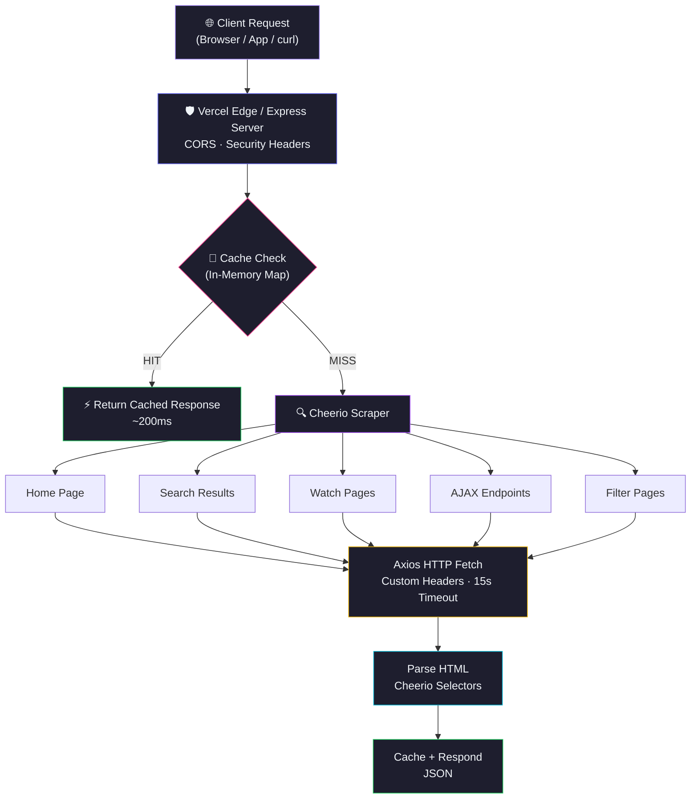
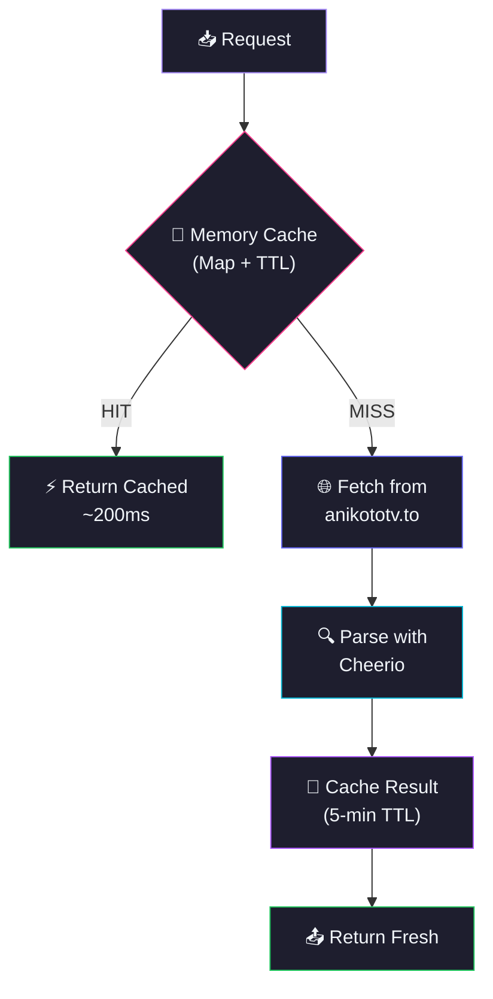

<div align="center">
  
  

</div>

<p align="center">
  <a href="https://github.com/Shineii86/AniKatoAPI/stargazers"></a>
  <a href="https://github.com/Shineii86/AniKatoAPI/network/members"></a>
  <a href="https://github.com/Shineii86/AniKatoAPI/issues"></a>
  <a href="https://github.com/Shineii86/AniKatoAPI/pulls"></a>
  <a href="https://github.com/Shineii86/AniKatoAPI/commits"></a>
  <a href="https://github.com/Shineii86/AniKatoAPI/blob/main/LICENSE"></a>
</p>

<p align="center">
  
  
  
  
  
  
  
  
</p>

<p align="center">
  <b>A complete RESTful API scraping real-time anime data from anikototv.to</b><br/>
  Search, browse, filter, watch — every endpoint returns live data with 5-minute smart caching.<br/>
  Built for building anime websites, apps, and bots.
</p>

<p align="center">
  <a href="#-table-of-contents">Table of Contents</a> &bull;
  <a href="#-features">Features</a> &bull;
  <a href="#-api-endpoints">API Docs</a> &bull;
  <a href="#-quick-start">Quick Start</a> &bull;
  <a href="#-deployment">Deployment</a> &bull;
  <a href="#-contributing">Contributing</a>
</p>

---

## 📖 Table of Contents

- [Overview](#-overview)
- [Features](#-features)
- [Anime Data Source](#-anime-data-source)
- [Tech Stack](#-tech-stack)
- [Architecture](#-architecture)
- [Project Structure](#-project-structure)
- [Quick Start](#-quick-start)
- [Configuration](#-configuration)
- [API Endpoints](#-api-endpoints)
- [API Response Schema](#-api-response-schema)
- [Deployment](#-deployment)
- [Available Scripts](#-available-scripts)
- [Performance](#-performance)
- [Changelog Highlights](#-changelog-highlights)
- [Troubleshooting](#-troubleshooting)
- [FAQ](#-faq)
- [Roadmap](#-roadmap)
- [Contributing](#-contributing)
- [Acknowledgements](#-acknowledgements)
- [License](#-license)
- [Author](#-author)
- [Star History](#-star-history)

---

## 🌸 Overview

**AniKatoAPI** is a serverless anime data API that scrapes and serves real-time information from **anikototv.to** — including anime details, episode lists, streaming servers, search, filtering, rankings, and more — all through a clean REST API with zero database setup.

> 💡 No database, no auth, no complex setup. Just deploy to Vercel and you have a production API.

### Why AniKatoAPI?

- 🎬 **24 Endpoints** — Complete coverage of anikototv.to data
- 🔍 **Full-Text Search** — Search anime by keyword with suggestions
- 📺 **Episode Lists** — AJAX-loaded episode data with server info
- 🎯 **Smart Filtering** — Genre, type, status, rating, sort, season, year
- 🏆 **Rankings** — Top 10 (day/week/month), trending, most popular
- 🎲 **Random Anime** — Random anime discovery endpoint
- ⚡ **Smart Caching** — 5-minute TTL reduces source site load
- 🔒 **CORS Enabled** — Works from any frontend, no proxy needed
- 🚀 **Zero-Config Deploy** — One click to Vercel, or run standalone with Express
- 📊 **Live Data** — Every response is fresh from the actual website

### How It Works



---

## ✨ Features

<table>
  <tr>
    <td>

### ⚡ Core
- **Real-time scraping** from anikototv.to
- **Smart caching** with 5-minute TTL
- **24 RESTful endpoints** covering all data
- **AJAX episode loading** for accurate data
- **Mapper API integration** for extra servers
- **Graceful error handling** per endpoint

    </td>
    <td>

### 🔍 Data
- **Keyword search** with pagination (`/api/search`)
- **Search suggestions** for autocomplete (`/api/search/suggest`)
- **Advanced filtering** — genre, type, status, rating, sort, season, year
- **AZ List** alphabetical browsing (`/api/az-list/:letter`)
- **Random anime** discovery (`/api/random`)
- **Top 10 rankings** day/week/month (`/api/top-ten`)

    </td>
  </tr>
  <tr>
    <td>

### 📺 Streaming
- **Watch page** — full episode data with servers
- **Stream info** — video embed URLs via AJAX
- **Server list** — all available streaming servers
- **Mapper API** — gogoanime/anivibe server sources
- **Episode navigation** — prev/next episode data
- **Next episode schedule** — countdown timer data

    </td>
    <td>

### 🛡️ Reliability
- **CORS enabled** — works from any frontend
- **Error responses** with descriptive messages
- **Input validation** — required params checked
- **Timeout protection** — 15s per request
- **Multiple domains** — fallback mirror support
- **Zero dependencies on databases** — pure scraping

    </td>
  </tr>
</table>

### 🌟 Feature Highlights

| Feature | Description | Status |
|:---|:---|:---:|
| 🎬 24 API Endpoints | Complete coverage of anime data | ✅ |
| 🔍 Full-Text Search | Keyword search with pagination | ✅ |
| 📺 Episode Lists | AJAX-loaded episode data | ✅ |
| 🎯 Advanced Filtering | Genre, type, status, rating, sort | ✅ |
| 🏆 Top 10 Rankings | Day/week/month leaderboards | ✅ |
| 🎲 Random Anime | Random anime discovery | ✅ |
| 📡 Streaming Servers | Video embed URLs + mapper API | ✅ |
| 📋 AZ List | A-Z alphabetical browsing | ✅ |
| 🔄 Smart Caching | 5-min TTL, in-memory Map | ✅ |
| 🚀 One-Click Deploy | Vercel button deployment | ✅ |
| 🏗️ Express Mode | Standalone server with `npm start` | ✅ |
| 📖 AlisaReactionBot Style | Full JSDoc documentation | ✅ |

---

## 🗞️ Anime Data Source

| Source | Domain | Status | Data |
|:---|:---|:---|:---|
| **AniKato** | `anikototv.to` | ✅ Active | Primary source |
| **AniKato** | `anikoto.cz` | ✅ Active | Mirror domain |
| **AniKato** | `anikoto.me` | ✅ Active | Mirror domain |
| **AniKato** | `anikoto.net` | ✅ Active | Mirror domain |
| **AniKato** | `anikoto.se` | ✅ Active | Mirror domain |

### Data Available

| Category | Count | Source |
|:---|:---|:---|
| 🎬 Total Anime | 10,000+ | anikototv.to |
| 📺 Total Episodes | 100,000+ | AJAX endpoints |
| 🏷️ Genres | 43 | Genre pages |
| 🎭 Types | 6 | TV, Movie, OVA, ONA, Special, Music |
| 📊 Statuses | 3 | Airing, Finished, Not Yet Aired |

---

## 🛠️ Tech Stack

| Technology | Purpose | Version | Documentation |
|:---|:---|:---|:---|
| 🟢 [Node.js](https://nodejs.org/) | JavaScript runtime | >= 20 | [Docs](https://nodejs.org/docs/) |
| ⚡ [Express](https://expressjs.com/) | HTTP server framework | 5.2 | [Docs](https://expressjs.com/en/5x/api.html) |
| ▲ [Vercel Functions](https://vercel.com/docs/functions) | Serverless deployment | — | [Docs](https://vercel.com/docs/functions) |
| 🔍 [Cheerio](https://cheerio.js.org/) | HTML parsing & scraping | 1.0 | [Docs](https://cheerio.js.org/docs/) |
| 🌐 [Axios](https://axios-http.com/) | HTTP client | 1.11 | [Docs](https://axios-http.com/docs/intro) |
| 🔧 [dotenv](https://github.com/motdotla/dotenv) | Environment variables | 17.2 | [Docs](https://github.com/motdotla/dotenv) |
| 🔒 [cors](https://github.com/expressjs/cors) | CORS middleware | 2.8 | [Docs](https://github.com/expressjs/cors) |
| 🍪 [cookie-parser](https://github.com/expressjs/cookie-parser) | Cookie parsing | 1.4 | [Docs](https://github.com/expressjs/cookie-parser) |

### 📦 Key Dependencies

```json
{
  "express": "^5.2.0",        // HTTP server
  "axios": "^1.11.0",         // HTTP client for scraping
  "cheerio": "^1.0.0-rc.12",  // HTML parsing
  "cors": "^2.8.5",           // CORS middleware
  "dotenv": "^17.2.0",        // Environment variables
  "cookie-parser": "^1.4.7"   // Cookie parsing
}
```

---

## 🏗️ Architecture

### Request Flow

| Stage | Component | Description |
|:-----:|-----------|-------------|
| 1 | **Client** | Browser, app, or `curl` sends request |
| 2 | **Vercel Edge / Express** | Routes request, applies CORS + security headers |
| 3 | **Cache Check** | In-memory Map with 5-min TTL — hit = instant response |
| 4 | **Scrape Source** | Axios fetches HTML from anikototv.to with custom headers |
| 5 | **Parse HTML** | Cheerio extracts data using CSS selectors |
| 6 | **Cache + Respond** | Store in cache, return JSON response |

### Caching Architecture



> 💡 Serverless functions have read-only filesystems except `/tmp`. The cache uses in-memory `Map` which survives across warm invocations.

---

## 📁 Project Structure

```
AniKatoAPI/
├── 📂 public/                            # 🌐 Static files
│   ├── 📄 index.html                     #    📖 API documentation page
│   └── 📄 404.html                       #    ❌ Custom 404 error page
│
├── 📂 src/                               # ⚙️ Core logic
│   ├── 📂 configs/                       #    🔧 Configuration files
│   │   ├── 📄 dataUrl.js                 #       🌐 URL patterns for anikototv.to
│   │   ├── 📄 header.config.js           #       📋 Request headers
│   │   └── 📄 ids.config.js              #       🏷️ Genre/Type/Status/Rating ID mappings
│   │
│   ├── 📂 controllers/                   #    🎮 Route handlers (22 files)
│   │   ├── 📄 homeInfo.controller.js
│   │   ├── 📄 animeInfo.controller.js
│   │   ├── 📄 search.controller.js
│   │   ├── 📄 episodeList.controller.js
│   │   ├── 📄 episodeListAjax.controller.js
│   │   ├── 📄 streamInfo.controller.js
│   │   ├── 📄 filter.controller.js
│   │   ├── 📄 watchPage.controller.js
│   │   └── 📄 ... (14 more)
│   │
│   ├── 📂 extractors/                    #    🔍 HTML scrapers (22 files)
│   │   ├── 📄 homeInfo.extractor.js      #       🏠 Home page data
│   │   ├── 📄 search.extractor.js        #       🔍 Search results
│   │   ├── 📄 animeInfo.extractor.js     #       📺 Anime details
│   │   ├── 📄 streamInfo.extractor.js    #       📡 Streaming servers
│   │   ├── 📄 filter.extractor.js        #       🎯 Filtered results
│   │   ├── 📄 watchPage.extractor.js     #       ▶️ Watch page data
│   │   ├── 📄 episodeList.extractor.js   #       📋 Episode lists
│   │   └── 📄 ... (15 more)
│   │
│   ├── 📂 helper/                        #    🛠️ Utility functions
│   │   ├── 📄 cache.helper.js            #       💾 In-memory caching
│   │   ├── 📄 countPages.helper.js       #       📄 Pagination counter
│   │   ├── 📄 extractPages.helper.js     #       📃 Page fetcher
│   │   └── 📄 formatTitle.helper.js      #       🔤 Title formatter
│   │
│   └── 📂 routes/                        #    🛤️ Express routes
│       ├── 📄 apiRoutes.js               #       🌐 Main API routes (24 endpoints)
│       └── 📄 category.route.js          #       🏷️ Category routes
│
├── 📄 server.js                          # 🚀 Express server entry point
├── 📄 package.json                       # 📦 Dependencies & scripts
├── 📄 vercel.json                        # ▲ Vercel routing & headers config
├── 📄 CHANGELOG.md                       # 📝 Version history
├── 📄 LICENSE                            # 📜 MIT License
└── 📄 README.md                          # 📖 This file
```

---

## 🚀 Quick Start

### Prerequisites

| Requirement | Minimum | Recommended |
|:---|:---|:---|
| 📦 Node.js | 20.x | 20.x LTS |
| 📦 npm | 9.0+ | 10.x |
| 💻 OS | Windows, macOS, Linux | Any |

### 🔧 Installation

```bash
# 1️⃣ Clone the repository
git clone https://github.com/Shineii86/AniKatoAPI.git
cd AniKatoAPI

# 2️⃣ Install dependencies
npm install

# 3️⃣ Start development server
npm run dev
```

> 🌐 Open [http://localhost:4444](http://localhost:4444) in your browser.

### 🏗️ Build for Production

```bash
# Start production server
npm start
```

### 🐳 Alternative Package Managers

```bash
# Using yarn
yarn install
yarn dev

# Using pnpm
pnpm install
pnpm dev

# Using bun
bun install
bun dev
```

---

## ⚙️ Configuration

### Environment Variables

| Variable | Default | Description |
|:---|:---|:---|
| `PORT` | `4444` | Server port (Express mode only) |
| `ALLOWED_ORIGINS` | `*` | Comma-separated allowed origins |

### Vercel Configuration

The `vercel.json` file handles:
- **Builds** — Maps `server.js` to `@vercel/node`
- **Routes** — All requests forwarded to Express
- **Headers** — CORS `Access-Control-Allow-Origin: *`

---

## 📡 API Endpoints

### Base URL
```
https://anikato.vercel.app/api
```

---

### `GET /api/`

Home page data — spotlight carousel, trending anime, top airing, and genre list.

```bash
curl "https://anikato.vercel.app/api/"
```

<details>
<summary>📄 Example Response</summary>

```json
{
  "success": true,
  "results": {
    "spotlights": [
      {
        "slug": "one-piece-odmau",
        "poster": "https://image.tmdb.org/t/p/original/a6ptrTUH1c5OdWanjyYtAkOuYD0.jpg",
        "title": "One Piece",
        "japaneseTitle": "One Piece",
        "description": "",
        "rating": "PG-13",
        "quality": "HD",
        "sub": 0,
        "dub": 0,
        "date": "Oct 20, 1999 to ?"
      }
    ],
    "trending": [
      {
        "slug": "one-piece-odmau/ep-1165",
        "poster": "https://cdn.anipixcdn.co/thumbnail/f899139df5e1059396431415e770c6dd.jpg",
        "title": "One Piece",
        "japaneseTitle": "One Piece",
        "sub": 1165,
        "dub": 1133,
        "total": 0,
        "type": "TV"
      }
    ],
    "topAiring": [
      {
        "slug": "one-piece-odmau",
        "poster": "https://cdn.anipixcdn.co/thumbnail/f899139df5e1059396431415e770c6dd.jpg",
        "title": "One Piece",
        "sub": 1165,
        "dub": 1133,
        "type": ""
      }
    ],
    "genres": [
      "Action", "Adventure", "Comedy", "Drama", "Fantasy",
      "Horror", "Isekai", "Mecha", "Mystery", "Romance",
      "Sci-Fi", "Slice of Life", "Sports", "Supernatural", "Thriller"
    ]
  }
}
```
</details>

---

### `GET /api/search`

Search anime by keyword with pagination.

| Param | Type | Default | Description |
|:---|:---|:---|:---|
| `keyword` | `string` | **required** | Search query |
| `page` | `number` | `1` | Page number |

```bash
curl "https://anikato.vercel.app/api/search?keyword=one+piece"
```

<details>
<summary>📄 Example Response</summary>

```json
{
  "success": true,
  "results": {
    "totalPages": 11,
    "data": [
      {
        "slug": "one-piece-episode-of-luffy-hand-island-adventure-br7lf/ep-1",
        "animeId": "769",
        "poster": "https://cdn.anipixcdn.co/thumbnail/4f16c818875d9fcb6867c7bdc89be7eb.jpg",
        "title": "One Piece: Episode of Luffy - Hand Island Adventure",
        "japaneseTitle": "One Piece: Episode of Luffy - Hand Island no Bouken",
        "sub": 1,
        "dub": 0,
        "total": 0,
        "type": "Special",
        "rating": "7.68",
        "genres": ["Action", "Adventure", "Fantasy", "Comedy", "Shounen", "Super Power"]
      },
      {
        "slug": "one-piece-odmau/ep-1",
        "animeId": "1642",
        "poster": "https://cdn.anipixcdn.co/thumbnail/f899139df5e1059396431415e770c6dd.jpg",
        "title": "One Piece",
        "japaneseTitle": "One Piece",
        "sub": 1165,
        "dub": 1133,
        "total": 0,
        "type": "TV",
        "rating": "8.73",
        "genres": ["Action", "Adventure", "Fantasy", "Comedy", "Shounen", "Super Power", "Drama"]
      }
    ]
  }
}
```
</details>

---

### `GET /api/search/suggest`

Search suggestions for autocomplete (returns max 10 results).

| Param | Type | Default | Description |
|:---|:---|:---|:---|
| `keyword` | `string` | **required** | Search query |

```bash
curl "https://anikato.vercel.app/api/search/suggest?keyword=one+piece"
```

<details>
<summary>📄 Example Response</summary>

```json
{
  "success": true,
  "results": [
    {
      "slug": "one-piece-odmau/ep-1",
      "poster": "https://cdn.anipixcdn.co/thumbnail/f899139df5e1059396431415e770c6dd.jpg",
      "title": "One Piece",
      "japaneseTitle": "One Piece",
      "type": "TV"
    }
  ]
}
```
</details>

---

### `GET /api/info`

Detailed anime information including synopsis, genres, studios, and more.

| Param | Type | Default | Description |
|:---|:---|:---|:---|
| `id` | `string` | **required** | Anime slug |

```bash
curl "https://anikato.vercel.app/api/info?id=one-piece-odmau"
```

<details>
<summary>📄 Example Response</summary>

```json
{
  "success": true,
  "results": {
    "slug": "one-piece-odmau",
    "animeId": 1642,
    "title": "One Piece",
    "japaneseTitle": "One Piece",
    "altNames": "",
    "poster": "https://cdn.anipixcdn.co/thumbnail/f899139df5e1059396431415e770c6dd.jpg",
    "backgroundImage": "...",
    "synopsis": "Gol D. Roger was known as the Pirate King...",
    "type": "TV",
    "premiered": "Fall 1999",
    "aired": "Oct 20, 1999",
    "status": "Currently Airing",
    "malScore": "8.73",
    "duration": "24 min",
    "episodes": "Unknown",
    "studios": ["Toei Animation"],
    "producers": [],
    "genres": ["Action", "Adventure", "Fantasy", "Comedy", "Shounen", "Super Power", "Drama"],
    "rating": "8.73",
    "reviewCount": "0"
  }
}
```
</details>

---

### `GET /api/watch`

Complete watch page data — anime info, episode list, servers, trending, and recommended.

| Param | Type | Default | Description |
|:---|:---|:---|:---|
| `slug` | `string` | **required** | Anime slug |
| `ep` | `number` | **required** | Episode number |

```bash
curl "https://anikato.vercel.app/api/watch?slug=one-piece-odmau&ep=1165"
```

<details>
<summary>📄 Example Response</summary>

```json
{
  "success": true,
  "results": {
    "slug": "one-piece-odmau",
    "animeId": 1642,
    "animeUrl": "/watch/one-piece-odmau",
    "title": "One Piece",
    "japaneseTitle": "One Piece",
    "episodeNumber": 1165,
    "synopsis": "Gol D. Roger was known as the Pirate King...",
    "type": "TV",
    "status": "Currently Airing",
    "malScore": "8.73",
    "duration": "24 min",
    "episodes": "Unknown",
    "studios": ["Toei Animation"],
    "genres": ["Action", "Adventure", "Fantasy"],
    "rating": "8.73",
    "poster": "https://cdn.anipixcdn.co/thumbnail/f899139df5e1059396431415e770c6dd.jpg",
    "backgroundImage": "...",
    "nextEpisodeDate": "",
    "nextEpisodeTimestamp": 0,
    "servers": [
      {
        "linkId": "...",
        "epId": "...",
        "cmId": "...",
        "svId": "...",
        "name": "Vidstreaming",
        "type": "sub"
      }
    ],
    "trending": [...],
    "recommended": [...]
  }
}
```
</details>

---

### `GET /api/episodes/:id`

Episode list for an anime (loaded via AJAX for accuracy).

| Param | Type | Default | Description |
|:---|:---|:---|:---|
| `id` | `string` | **required** | Anime slug |

```bash
curl "https://anikato.vercel.app/api/episodes/one-piece-odmau"
```

<details>
<summary>📄 Example Response</summary>

```json
{
  "success": true,
  "results": {
    "animeId": 1642,
    "slug": "one-piece-odmau",
    "totalEpisodes": 0,
    "episodes": []
  }
}
```
</details>

---

### `GET /api/episodes-ajax/:id`

Raw AJAX episode list response from the source site.

| Param | Type | Default | Description |
|:---|:---|:---|:---|
| `id` | `number` | **required** | Anime ID |

```bash
curl "https://anikato.vercel.app/api/episodes-ajax/1642"
```

---

### `GET /api/stream`

Streaming server info — extracts video embed URL via AJAX.

| Param | Type | Default | Description |
|:---|:---|:---|:---|
| `id` | `string` | **required** | Link ID from server buttons |

```bash
curl "https://anikato.vercel.app/api/stream?id={linkId}"
```

---

### `GET /api/servers`

Server list for an episode.

| Param | Type | Default | Description |
|:---|:---|:---|:---|
| `ids` | `string` | **required** | Episode IDs |

```bash
curl "https://anikato.vercel.app/api/servers?ids={episodeIds}"
```

---

### `GET /api/mapper-servers`

Mapper API — fetches additional streaming servers from gogoanime/anivibe via nekostream.

| Param | Type | Default | Description |
|:---|:---|:---|:---|
| `malId` | `number` | **required** | MyAnimeList ID |
| `slug` | `string` | **required** | Anime slug |
| `timestamp` | `number` | **required** | Current timestamp |

```bash
curl "https://anikato.vercel.app/api/mapper-servers?malId=21&slug=one-piece&timestamp=1717900000"
```

---

### `GET /api/top-ten`

Top 10 anime rankings for day, week, and month.

```bash
curl "https://anikato.vercel.app/api/top-ten"
```

<details>
<summary>📄 Example Response</summary>

```json
{
  "success": true,
  "results": {
    "today": [
      { "slug": "one-piece-odmau", "rank": 1, "name": "One Piece", "poster": "...", "sub": 1165, "dub": 1133, "type": "" },
      { "slug": "that-time-i-got-reincarnated-as-a-slime-season-4-0u851", "rank": 2, "name": "That Time I Got Reincarnated as a Slime Season 4", "sub": 9, "dub": 7 },
      { "slug": "wistoria-wand-and-sword-season-2-dua04", "rank": 3, "name": "Wistoria: Wand and Sword Season 2", "sub": 9, "dub": 7 }
    ],
    "week": [
      { "slug": "one-piece-odmau", "rank": 1, "name": "One Piece", "sub": 1165, "dub": 1133 },
      { "slug": "re-zero-starting-life-in-another-world-season-4-4hk9h", "rank": 2, "name": "Re:ZERO Season 4", "sub": 9, "dub": 9 },
      { "slug": "that-time-i-got-reincarnated-as-a-slime-season-4-0u851", "rank": 3, "name": "Tensei Slime Season 4", "sub": 9, "dub": 7 }
    ],
    "month": [
      { "slug": "one-piece-odmau", "rank": 1, "name": "One Piece", "sub": 1165, "dub": 1133 },
      { "slug": "that-time-i-got-reincarnated-as-a-slime-season-4-0u851", "rank": 2, "name": "Tensei Slime Season 4", "sub": 9, "dub": 7 },
      { "slug": "wistoria-wand-and-sword-season-2-dua04", "rank": 3, "name": "Wistoria Season 2", "sub": 9, "dub": 7 }
    ]
  }
}
```
</details>

---

### `GET /api/spotlight`

Spotlight carousel data — featured anime with posters, descriptions, and ratings.

```bash
curl "https://anikato.vercel.app/api/spotlight"
```

<details>
<summary>📄 Example Response</summary>

```json
{
  "success": true,
  "results": [
    {
      "slug": "one-piece-odmau",
      "poster": "https://image.tmdb.org/t/p/original/a6ptrTUH1c5OdWanjyYtAkOuYD0.jpg",
      "title": "One Piece",
      "japaneseTitle": "One Piece",
      "description": "",
      "rating": "PG-13",
      "quality": "HD",
      "sub": 0,
      "dub": 0,
      "date": "Oct 20, 1999 to ?"
    },
    {
      "slug": "that-time-i-got-reincarnated-as-a-slime-season-4-0u851",
      "poster": "https://cdn.anipixcdn.co/background/14c2f4ab3ad95f50_1778862809.jpg",
      "title": "That Time I Got Reincarnated as a Slime Season 4",
      "japaneseTitle": "Tensei shitara Slime Datta Ken 4th Season",
      "rating": "PG-13",
      "quality": "HD"
    }
  ]
}
```
</details>

---

### `GET /api/trending`

Trending anime — recently updated episodes with sub/dub counts.

```bash
curl "https://anikato.vercel.app/api/trending"
```

<details>
<summary>📄 Example Response</summary>

```json
{
  "success": true,
  "results": [
    {
      "slug": "one-piece-odmau/ep-1165",
      "poster": "https://cdn.anipixcdn.co/thumbnail/f899139df5e1059396431415e770c6dd.jpg",
      "title": "One Piece",
      "japaneseTitle": "One Piece",
      "sub": 1165,
      "dub": 1133,
      "total": 0,
      "type": "TV"
    },
    {
      "slug": "wistoria-wand-and-sword-season-2-dua04/ep-9",
      "poster": "https://cdn.anipixcdn.co/thumbnail/4739d8dbd05dddb73604f6240b83ea68.jpg",
      "title": "Wistoria: Wand and Sword Season 2",
      "sub": 9,
      "dub": 7,
      "total": 12,
      "type": "TV"
    }
  ]
}
```
</details>

---

### `GET /api/random`

Random anime — follows redirect to a random anime page and returns full info.

```bash
curl "https://anikato.vercel.app/api/random"
```

<details>
<summary>📄 Example Response</summary>

```json
{
  "success": true,
  "results": {
    "slug": "https://anikototv.to/random",
    "animeId": 998,
    "title": "Saint Young Men (Movie)",
    "japaneseTitle": "Saint Oniisan (Movie)",
    "poster": "https://cdn.anipixcdn.co/thumbnail/6081594975a764c8e3a691fa2b3a321d.jpg",
    "type": "Movie",
    "synopsis": "What if Jesus and Buddha were living on Earth in modern times?",
    "rating": "7.86   7.86 /10",
    "genres": ["Comedy", "Slice of Life", "Seinen"],
    "url": "https://anikototv.to/random"
  }
}
```
</details>

---

### `GET /api/most-popular`

Most popular anime with pagination — sorted by view count.

| Param | Type | Default | Description |
|:---|:---|:---|:---|
| `page` | `number` | `1` | Page number |

```bash
curl "https://anikato.vercel.app/api/most-popular?page=1"
```

<details>
<summary>📄 Example Response</summary>

```json
{
  "success": true,
  "results": {
    "totalPages": 293,
    "data": [
      {
        "slug": "solo-leveling-season-2-arise-from-the-shadow-3eukp/ep-1",
        "animeId": "7457",
        "poster": "https://cdn.anipixcdn.co/thumbnail/4b5ed938de41e4ff532c02c27dfd143a.jpg",
        "title": "Solo Leveling Season 2: Arise from the Shadow",
        "sub": 13, "dub": 13, "total": 13,
        "type": "TV", "rating": "8.87"
      },
      {
        "slug": "one-piece-odmau/ep-1",
        "animeId": "1642",
        "title": "One Piece",
        "sub": 1165, "dub": 1133,
        "type": "TV", "rating": "8.73"
      },
      {
        "slug": "dandadan-lzcmw/ep-1",
        "animeId": "4",
        "title": "Dandadan",
        "sub": 12, "dub": 12,
        "type": "TV", "rating": "8.75"
      }
    ]
  }
}
```
</details>

---

### `GET /api/new-release`

Newly released anime with pagination.

| Param | Type | Default | Description |
|:---|:---|:---|:---|
| `page` | `number` | `1` | Page number |

```bash
curl "https://anikato.vercel.app/api/new-release?page=1"
```

---

### `GET /api/newly-added`

Recently added anime with pagination.

| Param | Type | Default | Description |
|:---|:---|:---|:---|
| `page` | `number` | `1` | Page number |

```bash
curl "https://anikato.vercel.app/api/newly-added?page=1"
```

---

### `GET /api/trending-sidebar`

Sidebar data — trending (day/week/month) + latest episodes for widget display.

```bash
curl "https://anikato.vercel.app/api/trending-sidebar"
```

<details>
<summary>📄 Example Response</summary>

```json
{
  "success": true,
  "results": {
    "day": [
      { "slug": "one-piece-odmau", "rank": 1, "name": "One Piece", "sub": 1165, "dub": 1133 },
      { "slug": "that-time-i-got-reincarnated-as-a-slime-season-4-0u851", "rank": 2, "name": "Tensei Slime S4", "sub": 9, "dub": 7 }
    ],
    "week": [...],
    "month": [...],
    "latestEpisodes": [
      {
        "slug": "one-piece-odmau/ep-1165",
        "title": "One Piece",
        "sub": 1165, "dub": 1133,
        "type": "TV"
      }
    ]
  }
}
```
</details>

---

### `GET /api/schedule`

Anime schedule for a specific date.

| Param | Type | Default | Description |
|:---|:---|:---|:---|
| `date` | `string` | **required** | Date in `YYYY-MM-DD` format |

```bash
curl "https://anikato.vercel.app/api/schedule?date=2026-06-08"
```

---

### `GET /api/filter`

Advanced filtering with multiple criteria.

| Param | Type | Default | Description |
|:---|:---|:---|:---|
| `keyword` | `string` | `""` | Search keyword (required by site) |
| `genre` | `string` | — | Comma-separated genre slugs |
| `type` | `string` | — | Comma-separated types |
| `status` | `string` | — | Comma-separated statuses |
| `language` | `string` | — | `sub`, `dub` |
| `rating` | `string` | — | `g`, `pg`, `pg-13`, `r`, `r+`, `rx` |
| `sort` | `string` | — | `latest-updated`, `score`, `name-az`, etc. |
| `season` | `string` | — | `spring`, `summer`, `fall`, `winter` |
| `year` | `number` | — | e.g. `2026` |
| `page` | `number` | `1` | Page number |

**Available Genres:** `action`, `adventure`, `cars`, `comedy`, `dementia`, `demons`, `drama`, `ecchi`, `fantasy`, `game`, `harem`, `historical`, `horror`, `isekai`, `josei`, `kids`, `magic`, `mahou-shoujo`, `martial-arts`, `mecha`, `military`, `music`, `mystery`, `parody`, `police`, `psychological`, `romance`, `samurai`, `school`, `sci-fi`, `seinen`, `shoujo`, `shoujo-ai`, `shounen`, `shounen-ai`, `slice-of-life`, `space`, `sports`, `super-power`, `supernatural`, `thriller`, `unknown`, `vampire`

**Available Types:** `movie`, `music`, `ona`, `ova`, `special`, `tv`

**Available Statuses:** `currently-airing`, `finished-airing`, `not-yet-aired`

**Available Sorts:** `default`, `latest-updated`, `latest-added`, `score`, `name-az`, `release-date`, `most-viewed`, `number_of_episodes`

```bash
curl "https://anikato.vercel.app/api/filter?genre=action&type=tv&page=1"
```

---

### `GET /api/genre/:name`

Browse anime by genre.

| Param | Type | Default | Description |
|:---|:---|:---|:---|
| `name` | `string` | **required** | Genre slug (e.g. `action`, `comedy`) |
| `page` | `number` | `1` | Page number |

```bash
curl "https://anikato.vercel.app/api/genre/action?page=1"
```

---

### `GET /api/type/:name`

Browse anime by type.

| Param | Type | Default | Description |
|:---|:---|:---|:---|
| `name` | `string` | **required** | Type slug (`tv`, `movie`, `ova`, `ona`, `special`) |
| `page` | `number` | `1` | Page number |

```bash
curl "https://anikato.vercel.app/api/type/movie?page=1"
```

---

### `GET /api/status/:name`

Browse anime by airing status.

| Param | Type | Default | Description |
|:---|:---|:---|:---|
| `name` | `string` | **required** | Status slug |
| `page` | `number` | `1` | Page number |

```bash
curl "https://anikato.vercel.app/api/status/currently-airing?page=1"
```

---

### `GET /api/az-list/:letter`

Browse anime alphabetically.

| Param | Type | Default | Description |
|:---|:---|:---|:---|
| `letter` | `string` | **required** | Letter (`a`-`z`, `0-9`, `other`, `all`) |
| `page` | `number` | `1` | Page number |

```bash
curl "https://anikato.vercel.app/api/az-list/a?page=1"
```

<details>
<summary>📄 Example Response</summary>

```json
{
  "success": true,
  "results": {
    "totalPages": 19,
    "letter": "a",
    "data": [
      {
        "slug": "a-silent-voice-fghla/ep-1",
        "poster": "https://cdn.anipixcdn.co/thumbnail/6512bd43d9caa6e02c990b0a82652dca.jpg",
        "title": "A Silent Voice",
        "japaneseTitle": "Koe no Katachi",
        "sub": 1, "dub": 1, "total": 0,
        "type": "Movie", "rating": ""
      },
      {
        "slug": "attack-on-titan-bgaoa/ep-1",
        "title": "Attack on Titan",
        "japaneseTitle": "Shingeki no Kyojin",
        "sub": 25, "dub": 25, "total": 25,
        "type": "TV", "rating": "8.52"
      }
    ]
  }
}
```
</details>

---

### `GET /api/suggestions`

Search suggestions for autocomplete (returns max 10 results).

| Param | Type | Default | Description |
|:---|:---|:---|:---|
| `keyword` | `string` | **required** | Search query |

```bash
curl "https://anikato.vercel.app/api/suggestions?keyword=naruto"
```

<details>
<summary>📄 Example Response</summary>

```json
{
  "success": true,
  "results": [
    {
      "slug": "naruto-shippuden-c8gov/ep-1",
      "poster": "https://cdn.anipixcdn.co/thumbnail/82cec96096d4281b7c95cd7e74623496.jpg",
      "title": "Naruto: Shippuden",
      "japaneseTitle": "Naruto: Shippuuden",
      "type": "TV",
      "sub": 500,
      "dub": 500
    },
    {
      "slug": "the-last-naruto-the-movie-whib1/ep-1",
      "title": "The Last: Naruto the Movie",
      "type": "Movie",
      "sub": 1,
      "dub": 1
    }
  ]
}
```
</details>

---

## 📋 API Response Schema

### Success Response
```json
{
  "success": true,
  "results": { ... }
}
```

### Error Response
```json
{
  "success": false,
  "message": "Error description"
}
```

### Anime Item Object

| Field | Type | Description | Example |
|:---|:---|:---|:---|
| `slug` | `string` | URL-safe identifier | `"one-piece-odmau"` |
| `animeId` | `number/string` | Internal ID | `1642` |
| `poster` | `string` | Thumbnail URL | `"https://cdn.anipixcdn.co/..."` |
| `title` | `string` | English title | `"One Piece"` |
| `japaneseTitle` | `string` | Japanese title | `"One Piece"` |
| `sub` | `number` | Subbed episodes count | `1165` |
| `dub` | `number` | Dubbed episodes count | `1133` |
| `total` | `number` | Total episodes | `0` |
| `type` | `string` | Anime type | `"TV"` |
| `rating` | `string` | MAL rating | `"8.73"` |

### Spotlight Object

| Field | Type | Description | Example |
|:---|:---|:---|:---|
| `slug` | `string` | URL-safe identifier | `"one-piece-odmau"` |
| `poster` | `string` | Background image URL | `"https://..."` |
| `title` | `string` | English title | `"One Piece"` |
| `japaneseTitle` | `string` | Japanese title | `"One Piece"` |
| `description` | `string` | Synopsis | `"Gol D. Roger..."` |
| `rating` | `string` | Content rating | `"PG-13"` |
| `quality` | `string` | Video quality | `"HD"` |
| `sub` | `number` | Sub count | `0` |
| `dub` | `number` | Dub count | `0` |
| `date` | `string` | Air date range | `"Oct 20, 1999 to ?"` |

### Ranking Object

| Field | Type | Description | Example |
|:---|:---|:---|:---|
| `slug` | `string` | URL-safe identifier | `"one-piece-odmau"` |
| `rank` | `number` | Position (1-10) | `1` |
| `name` | `string` | Anime title | `"One Piece"` |
| `poster` | `string` | Thumbnail URL | `"https://..."` |
| `sub` | `number` | Sub count | `1165` |
| `dub` | `number` | Dub count | `1133` |
| `type` | `string` | Anime type | `"TV"` |

---

## 🌐 Deployment

### ▲ Vercel (Recommended)

[](https://vercel.com/new/clone?repository-url=https://github.com/Shineii86/AniKatoAPI)

1. Click the button above (or import manually on vercel.com)
2. Vercel auto-detects the project — **no config needed**
3. Your API is live! 🎉

```bash
# Or use Vercel CLI
npx vercel --prod
```

### 🖥️ Standalone Server

```bash
# Clone and install
git clone https://github.com/Shineii86/AniKatoAPI.git
cd AniKatoAPI && npm install

# Start production server
npm start
# → http://localhost:4444
```

### 🐳 Docker

```dockerfile
FROM node:20-alpine
WORKDIR /app
COPY package*.json ./
RUN npm ci --production
COPY . .
EXPOSE 4444
CMD ["node", "server.js"]
```

---

## 📜 Available Scripts

| Command | Description | Details |
|:---|:---|:---|
| `npm run dev` | 🔥 Start development server | Runs on `localhost:4444` |
| `npm start` | 🚀 Start production server | `node server.js` |
| `npm test` | 🧪 Run tests | Placeholder |

---

## ⚡ Performance

| Metric | Value |
|:---|:---|
| ⚡ Cached response | ~200ms |
| 🔄 Fresh fetch | ~1-3s |
| 💾 Cache TTL | 5 minutes |
| ⏱️ Timeout per request | 15 seconds |
| 🎬 Total anime indexed | 10,000+ |
| 📦 Total codebase | ~80KB |

### Optimization Features

- 💾 **In-memory cache** — Map-based with TTL expiration
- ⚡ **Cheerio parsing** — Fast HTML DOM traversal
- 🔧 **Custom headers** — Mimics browser requests
- 🎯 **Selective scraping** — Only extracts needed data
- 📁 **Minimal deps** — Only 6 production dependencies
- 🔄 **Graceful fallback** — Empty arrays on error, never crashes

---

## 📝 Changelog Highlights

| Version | Date | Key Changes |
|:---|:---|:---|
| **1.5.0** | 2026-06-08 | Complete documentation rewrite — 50+ files with AlisaReactionBot style |
| **1.4.0** | 2026-06-08 | Fixed ALL CSS selectors to match actual anikototv.to HTML structure |
| **1.3.0** | 2026-06-08 | Added streaming, mapper API, seasons, watch order, episode AJAX |
| **1.2.0** | 2026-06-08 | Added watch page, AZ list, new release, newly added, trending sidebar |
| **1.1.0** | 2026-06-08 | Corrected HTML selectors based on actual website analysis |
| **1.0.0** | 2026-06-08 | Initial release — 20+ endpoints, Vercel deployment |

> 📝 See [CHANGELOG.md](./CHANGELOG.md) for the full version history.

---

## 🔧 Troubleshooting

| Problem | Cause | Solution |
|:---|:---|:---|
| ❌ `npm install` fails | Node.js version too old | Upgrade to Node.js 20+ (`node -v`) |
| ❌ 500 error on filter | Missing `keyword` param | Add `?keyword=` (even empty) to filter requests |
| ❌ Empty episodes array | AJAX not loaded | Use `/api/episodes/:slug` which fetches via AJAX |
| ❌ CORS errors | Frontend domain blocked | CORS is `*` — check browser extension |
| ❌ 404 on API routes | Wrong URL format | Use `/api/` prefix, not just `/` |
| ❌ Deploy fails on Vercel | Build error | Check `node server.js` locally first |
| ❌ Slow first request | Serverless cold start | Normal — first request after idle takes ~3s |
| ❌ Rate limited | Too many requests | Cache reduces this — wait 5 min for TTL expiry |

### 🐛 Debug Mode

```bash
# Run with verbose logging
NODE_ENV=development npm run dev

# Test specific endpoint
curl http://localhost:4444/api/
curl http://localhost:4444/api/search?keyword=naruto
curl http://localhost:4444/api/top-ten
```

---

## ❓ FAQ

<details>
<summary><b>📰 How do I search for anime?</b></summary>
<br/>
Use <code>/api/search?keyword=your+search</code>. Results include title, poster, episodes, rating, and genres. For autocomplete suggestions, use <code>/api/search/suggest?keyword=your+search</code> which returns max 10 results.
</details>

<details>
<summary><b>📺 How do I get episode lists?</b></summary>
<br/>
Use <code>/api/episodes/:slug</code> where <code>:slug</code> is the anime URL slug (e.g., <code>one-piece-odmau</code>). This fetches episode data via AJAX for accuracy. The response includes <code>animeId</code>, <code>totalEpisodes</code>, and <code>episodes</code> array.
</details>

<details>
<summary><b>🎯 How does filtering work?</b></summary>
<br/>
Use <code>/api/filter</code> with query params. The <code>keyword</code> param is required by the source site (use empty string if not searching). Combine <code>genre</code>, <code>type</code>, <code>status</code>, <code>sort</code>, <code>season</code>, and <code>year</code> for advanced filtering.
</details>

<details>
<summary><b>📡 Can I use this in my frontend app?</b></summary>
<br/>
Yes! CORS is enabled for all origins (<code>*</code>). Just make fetch requests to the API endpoints. No API key needed. Example: <code>fetch('https://anikato.vercel.app/api/search?keyword=naruto')</code>
</details>

<details>
<summary><b>🔄 How often does the data refresh?</b></summary>
<br/>
The cache TTL is 5 minutes. After that, the next request triggers a fresh scrape from anikototv.to. This keeps data relatively fresh while reducing load on the source site.
</details>

<details>
<summary><b>🎲 What does the random endpoint do?</b></summary>
<br/>
<code>/api/random</code> follows a redirect on the source site to a random anime page, then returns the full anime info including title, synopsis, rating, genres, and poster.
</details>

<details>
<summary><b>🌐 Can I self-host this?</b></summary>
<br/>
Yes! Use <code>npm start</code> to run the Express server on any VPS, Docker container, or PaaS. The Vercel serverless functions are optional — <code>server.js</code> handles everything.
</details>

<details>
<summary><b>📊 How many anime are indexed?</b></summary>
<br/>
The API can access 10,000+ anime titles from anikototv.to. The most-popular endpoint alone has 293 pages of results with 30 items per page.
</details>

---

## 🗺️ Roadmap

### 🎯 Planned Features

- [ ] 🔐 **API key authentication** — Per-user rate limits
- [ ] 📊 **Analytics endpoint** — Usage statistics
- [ ] 🌙 **Dark/light mode** — Theme toggle for landing page
- [ ] 📱 **PWA support** — Install as app on mobile
- [ ] 🔔 **Webhook notifications** — Push new episodes to Discord
- [ ] 📈 **Rate limiting** — Per-IP request throttling
- [ ] 🗄️ **Redis cache** — Persistent caching for serverless
- [ ] 🌐 **Multi-language** — Sub/dub language metadata
- [ ] 🤖 **AI summaries** — Auto-generated anime descriptions
- [ ] 📦 **NPM package** — Client SDK for easy integration

### ✅ Completed

- [x] 🎬 24 API endpoints covering all data
- [x] 🔍 Full-text search with pagination
- [x] 📺 Episode lists via AJAX loading
- [x] 🎯 Advanced filtering (genre, type, status, rating, sort)
- [x] 🏆 Top 10 rankings (day/week/month)
- [x] 🎲 Random anime discovery
- [x] 📡 Streaming server info + mapper API
- [x] 📋 AZ List alphabetical browsing
- [x] 🔄 Smart caching with 5-min TTL
- [x] 🚀 One-click Vercel deployment
- [x] 📖 Comprehensive documentation
- [x] 🏗️ AlisaReactionBot-style code comments

---

## 🤝 Contributing

*Contributions are welcome and appreciated! Here's how you can help:*

<table>
<tr>
<td width="25%" align="center">

### 🐛 Report Bugs
Found something broken?

[Open an Issue](https://github.com/Shineii86/AniKatoAPI/issues)

</td>
<td width="25%" align="center">

### 💡 Suggest Features
Have an idea?

[Start a Discussion](https://github.com/Shineii86/AniKatoAPI/issues)

</td>
<td width="25%" align="center">

### 🔀 Submit PRs
Ready to contribute code?

[Fork & Submit](https://github.com/Shineii86/AniKatoAPI/fork)

</td>
</tr>
</table>

### 🔄 How to Contribute

```bash
# 1️⃣ Fork the repository
# Click the "Fork" button on GitHub

# 2️⃣ Clone your fork
git clone https://github.com/YOUR_USERNAME/AniKatoAPI.git
cd AniKatoAPI

# 3️⃣ Create a feature branch
git checkout -b feature/amazing-feature

# 4️⃣ Make your changes
# Edit files, add features, fix bugs...

# 5️⃣ Commit your changes
git commit -m 'feat: add amazing feature'

# 6️⃣ Push to your fork
git push origin feature/amazing-feature

# 7️⃣ Open a Pull Request
# Go to GitHub and create a PR
```

### 📋 Guidelines

- ✅ Follow the existing code style and documentation conventions
- ✅ Write meaningful commit messages (use [conventional commits](https://www.conventionalcommits.org/))
- ✅ Update CHANGELOG.md with your changes
- ✅ Keep PRs focused — one feature or fix per PR
- ✅ Add JSDoc comments for new functions
- ❌ Don't commit `node_modules` or cache files
- ❌ Don't add unrelated changes to a single PR

---

## 🙏 Acknowledgements

### 🎬 Data Source

| Source | About |
|:---|:---|
| [AniKato](https://anikototv.to) | Anime streaming site — primary data source |
| [AniKato CZ](https://anikoto.cz) | Mirror domain |
| [AniKato ME](https://anikoto.me) | Mirror domain |
| [AniKato NET](https://anikoto.net) | Mirror domain |
| [AniKato SE](https://anikoto.se) | Mirror domain |

### 🛠️ Technologies

- **[Express](https://expressjs.com/)** — Fast, unopinionated web framework
- **[Cheerio](https://cheerio.js.org/)** — Fast, flexible HTML parsing
- **[Axios](https://axios-http.com/)** — Promise-based HTTP client
- **[Vercel](https://vercel.com/)** — Serverless deployment platform

### 📝 Resources

- [Shields.io](https://shields.io/) — Badges for README
- [Star History](https://star-history.com/) — GitHub star history charts
- [Capsule Render](https://github.com/kyechan99/capsule-render) — Header banner generator

---

## 📄 License

<div align="center">

[](./LICENSE)

This project is licensed under the **MIT License**.

Free to use, modify, and distribute — see the [LICENSE](LICENSE) file for details.

</div>

---

## 👤 Author

<div align="center">

  <a href="https://github.com/Shineii86/AniKatoAPI">
  
  </a>
  
</div>
  
<p align="center">
  <b style="font-size: 5.5em;">Shinei Nouzen</b>
  <br/>
  <sub>Full-Stack Developer & Anime Enthusiast</sub>
  <br/><br/>
  <a href="https://github.com/Shineii86"></a>
  <a href="https://telegram.me/Shineii86"></a>
  <a href="https://instagram.com/ikx7.a"></a>
  <a href="mailto:ikx7a@hotmail.com"></a>
</p>

---

## ⭐ Star History

<p align="center">
  <a href="https://star-history.com/#Shineii86/AniKatoAPI&Date">
    
  </a>
</p>

> ⭐ If you found this project useful, please consider giving it a star!

---

<p align="center">
  <b>Made With ❤️ For The Anime Community</b>
  <br/><br/>
  <sub>© 2026 Shineii86. All Rights Reserved.</sub>
</p>
